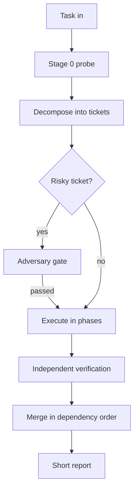
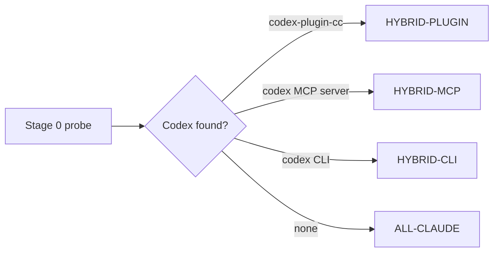
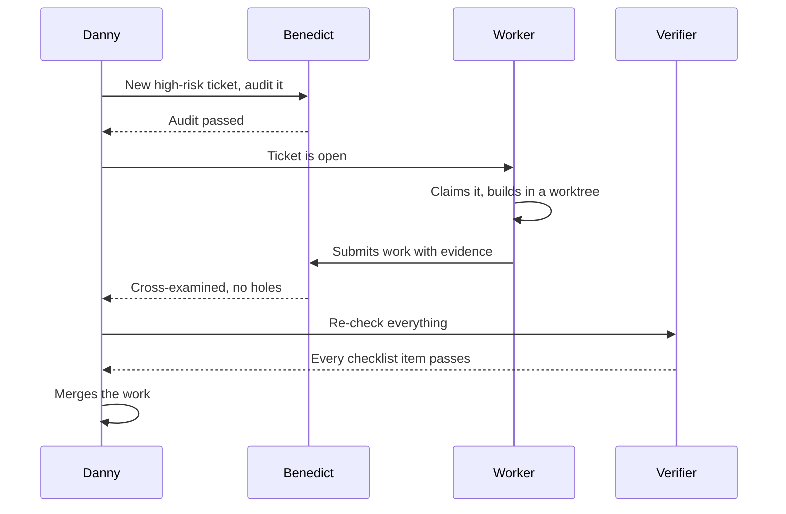

<p align="center">
  
</p>

# agent-team

You type one task into Claude Code. A coordinated crew of AI agents plans it, splits it into small jobs, does the work in parallel where that is safe, double-checks the risky parts, and reports back in plain language. You do not manage the agents and you do not copy anything anywhere. The session you are already sitting in becomes the crew boss and runs the whole job, start to finish, inside Claude Code.

## How it works, in plain words

Think of a heist movie.

**Danny Ocean plans the job.** When you hand agent-team a task, your Claude Code session takes on the role of the orchestrator (the one agent that makes every judgment call). Danny decides what the task really requires, writes a Definition of Done (a short checklist that says exactly when the job counts as finished), and breaks the work into tickets (small written job descriptions, each with its own checklist). He maps which tickets depend on which, so independent work can run at the same time while dependent work waits its turn. Danny keeps the thinking and delegates the doing. He touches code himself only under one narrow exception: a fix of ten lines or fewer, in one file, never in a risky area, and every such fix is logged and audited later.

**Terry Benedict tries to break the plan.** Benedict is the adversary (a dedicated critic agent that never writes code). Before any risky work starts, he audits the ticket and hunts for holes. After the work is submitted, he cross-examines the result against his own audit. He holds a veto: if he stamps a ticket REJECTED, that work freezes until the problem is fixed. Risky here means anything touching login and permissions, money, security, stored data, migrations (changes to how data is stored), shared state, caching, concurrency, public APIs, or workflows users see and rely on. Routine tickets skip the up-front audit but get spot-checked afterward, one in five.

**Specialists do the hands-on work.** Each ticket routes to a worker agent sized for the job. Hard problems get the strongest (and most expensive) models. Simple lookups get fast, cheap ones. Workers that edit code do it inside a worktree (a separate working copy of the project's files, created by git) so parallel workers never collide. Workers report progress with heartbeats (short timestamped log lines), and a stalled worker gets its ticket taken back and reassigned.

**A different crew member always double-checks.** When a worker finishes, another, cheaper agent re-runs the ticket's checklist and confirms the evidence. The verifier is never the author. Only after that does Danny merge the work (fold it back into the main project, in dependency order) and write you a short report.

The whole run is evidence-driven. Agents return test output, file paths, and diffs (line-by-line records of what changed), not promises.

### The lifecycle at a glance



## Stage 0: the crew checks its gear

Every run opens with a quick probe called Stage 0, before any real work. It confirms the session is on a strong model (it prefers Fable, then Opus 4.8, and warns you to switch with `/model` if the session is on something weaker). Then it looks for Codex (OpenAI's coding agent) on your machine, in a fixed order of preference.



The official plugin is the preferred path. MCP (Model Context Protocol, a standard way to plug outside tools into Claude Code) and the bare command-line tool are fallbacks.

If any Codex path is found, the topology (the shape of the team) is HYBRID: GPT-5.6 Sol takes the hardest build work and the adversary role, and Opus reviews the Codex-built code. Different model families miss different things, so cross-family review catches more. If nothing is found, the topology is ALL-CLAUDE: Opus absorbs those roles, and the run says once, honestly, that same-family review is weaker.

Stage 0 also checks that the project has been initialized (a `/specs/Agents.md` file with the crew's roles and rules) and offers to run `init` if it has not.

## What one risky ticket looks like

Here is the full path of a single high-risk ticket, from Danny's desk to the merge:



If Benedict rejects at either gate, the work goes back with his findings. A worker that fails twice escalates the ticket one tier up. Three failed loops and the ticket halts and lands back on Danny's desk.

## The crew

The crew members are named skins from Ocean's Eleven, layered over the tiers below. Every agent logs under an ASCII prefix so parallel work reads clearly in the terminal.

| Crew member | Log prefix | What they handle, in plain words |
|---|---|---|
| Danny Ocean | `[Danny] ->` | The orchestrator. Plans the job, routes every ticket, makes every final call. |
| Terry Benedict | `[Benedict] ->` | The adversary. Audits risky plans and finished work, holds the veto, never writes code. |
| Livingston Dell | `[Livingston] ->` | Security, plus observability (the logging and monitoring that let you see what a system is doing). |
| Rusty Ryan | `[Rusty] ->` | Code review and audit assistance. |
| Saul Bloom | `[Saul] ->` | Legacy code (old systems) and monoliths (big all-in-one codebases). |
| The Malloy Twins | `[Malloys] ->` | Concurrency and async work (code where many things happen at once). |
| Amazing Yen | `[Yen] ->` | Performance and optimization (making things measurably faster). |
| Frank Catton | `[Frank] ->` | Frontend and UI (the parts users see and click). |
| Basher Tarr | `[Basher] ->` | DevOps and CI/CD (the pipelines that build, test, and ship the code). |
| Linus Caldwell | `[Linus] ->` | Data extraction and scraping (pulling structured data out of files and pages). |
| Reuben Tishkoff | `[Reuben] ->` | Budget checkpoints. Watches token spend (tokens are the units AI usage is billed in) and speaks up before things get expensive. |

A ticket with no matching domain gets a plain `[Agent N] ->` label and no persona.

**Heist mode is on by default.** Agents speak in character in their log lines and report sections, and every report section closes with a plain-language summary in parentheses, so you never have to decode the theater. Next Steps are always written plain, in both modes. Say **"plain mode"** to turn the voice off while keeping the names as labels. There are no emoji in either mode.

## Tiers: who does what, on which engine

Underneath the skins, work routes by tier. The tier is picked from the ticket's difficulty and risk, so premium reasoning is spent only where judgment matters.

| Tier | Role | ALL-CLAUDE engine | HYBRID engine | Effort |
|---|---|---|---|---|
| Orchestrator | judgment: intent, architecture, tradeoffs, final review | fable, else opus 4.8 (the session itself) | same session; Codex is a worker, never the orchestrator | xhigh |
| Adversary | audits plans and risky submissions, veto power | opus 4.8 | gpt-5.6-sol | high |
| T1 hardest build | complex implementation, deep debugging, security-sensitive work | opus 4.8 | gpt-5.6-sol, with Opus reviewing its output | high |
| T2 systems | schemas, backend math, data consistency, concurrency, reviewing cheaper agents | opus 4.8 | gpt-5.6-terra | medium-high / high |
| T3 features | scoped implementation, tests, local refactors | sonnet 4.6 | gpt-5.6-terra | medium |
| T4 evidence | discovery, file and log summaries, checklist verification, boilerplate | haiku 4.5 | gpt-5.6-luna or gpt-5.4-mini | n/a / low |

Two rules keep the tiers honest: T3 never makes product or architecture calls, and T4 reports facts, never direction.

## Install (Claude Code)

Clone the skill, then copy the two commands into your commands folder.

Windows PowerShell:

```powershell
git clone https://github.com/thebpandey/agent-team "$env:USERPROFILE\.claude\skills\agent-team"
Copy-Item "$env:USERPROFILE\.claude\skills\agent-team\claude-code\agent-team.md" "$env:USERPROFILE\.claude\commands\agent-team.md"
Copy-Item "$env:USERPROFILE\.claude\skills\agent-team\claude-code\architect.md" "$env:USERPROFILE\.claude\commands\architect.md"
```

Mac or Linux:

```bash
git clone https://github.com/thebpandey/agent-team ~/.claude/skills/agent-team
cp ~/.claude/skills/agent-team/claude-code/agent-team.md ~/.claude/commands/agent-team.md
cp ~/.claude/skills/agent-team/claude-code/architect.md ~/.claude/commands/architect.md
```

Optional, for the HYBRID topology: install OpenAI's official Codex plugin inside Claude Code.

```
/plugin marketplace add openai/codex-plugin-cc
/plugin install codex@openai-codex
```

## Usage

Once per project, scaffold the protocol files:

```
/agent-team init
```

This creates `/specs/Agents.md` (the crew's roles and rules, which Codex also reads natively), `architecture.md` and `design.md` stubs, a `/goals/` folder for tickets, and the persistent crew definitions under `.claude/agents/agent-team/`. Nothing existing is ever overwritten.

Then hand it work, in plain words:

```
/agent-team harden the app before launch
/agent-team add CSV export to the reports page, plain mode
```

To plan without executing, use the architect command. It designs the lanes, drafts the tickets into `/goals/`, and pre-clears the risky ones with the Adversary, but changes no code:

```
/architect a billing subsystem with usage-based pricing
```

Run the session on the strongest model available (prefer Fable, else Opus 4.8). The skill warns you at Stage 0 if the session model is weaker.

## Safety notes

Merging is done by the orchestrator in dependency order. Enable branch protection and keep a human approval step on merges touching high-risk areas.

The codex-plugin-cc review gate (a Stop hook that blocks completion until a Codex review passes) is opt-in for high-risk phases only. OpenAI's own docs warn it can loop and drain usage limits quickly, so agent-team never enables it silently.

Ticket files treat pasted logs and PR text as data, not instructions.

Cost is real: Sol and Opus at high effort across many parallel tickets adds up. Every ticket carries a token budget, and the run checkpoints with you at 80 percent of the session budget (Reuben delivers that line in heist mode).

## License

Standalone, with no dependency on any other skill. MIT license, see [LICENSE](LICENSE).
