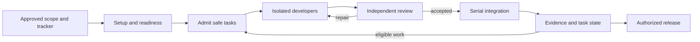

# Agent-Team

Created by [thebpandey](https://github.com/thebpandey). Agent-Team coordinates AI agents to build software from an approved plan, review the changes, and fix problems. You set the direction and approve important decisions; the team keeps tasks, progress, and focused working context together in Codex or Claude Code.

The native version is **[v8.0.12](https://github.com/thebpandey/agent-team/blob/main/docs/releases/8.0.12-readiness.md)**, an **unpublished candidate** repairing managed updates. [v8.0.11](https://github.com/thebpandey/agent-team/releases/tag/v8.0.11) was published on 2026-09-23, but an actual managed update failed with `revision: lifecycle journal budget exceeded`; it did not complete the update. Wait for the verified repair before upgrading an existing installation. Linux amd64 and Windows amd64 are package targets; macOS has source/runtime checks without a published binary. The historical Node package **v7.3.1** described in older sections is retained only for its historical runtime contract. The repository-root `SKILL.md` routes to the native controller and is not the Node runtime. For release history, see the [changelog](CHANGELOG.md); for the compact operator walkthrough, see [Getting Started](GETTING_STARTED.md).

## vNext native transition

External Ed25519 trust is not part of normal Agent-Team setup or use. It is a one-time fallback only for stale or unverifiable v7 cutover without a current canonical approval; fresh v8 projects and valid schema-4 receipt migrations do not require it. One machine trust key may sign separate short-lived, project-bound approvals.

For that fallback only, an authorized Linux operator may run `sudo bash scripts/provision-cutover-trust.sh`; it refuses existing keys or trust stores and performs no signing, cutover, or publication.

Install one checksum-verified native package and select the host explicitly: `agent-teamctl install --host codex|claude|both`. With no host variables, Codex uses `~/.agents` and Claude uses `~/.claude` on Windows, macOS, and Linux. Set `CODEX_HOME` or `CLAUDE_HOME` only on the first install for a custom location; the manifest preserves each resolved home for later update, rollback, and uninstall commands. A conflicting later override fails closed. Switching hosts is a foreground action and transfers no lease or worker identity. `rollback --version <version>` selects a unique release backup; add `--revision <commit>` when that version has multiple revisions. Rollback and `uninstall` touch only exact manifest-owned bytes and retain changed or unknown files.

The public lifecycle is `setup`, `status`, `start`, `task add`, and `one-off`, plus scoped `pause`, `stop`, `cancel`, and `resume`. FIX/CLEAN is an internal independent-review loop. Setup preserves the selected Beads or `TASKS.md` tracker; it does not require conversion to Beads. After an explicitly approved legacy cutover to Beads, the old `TASKS.md` remains provenance. `BLOCKERS.md` and `DECISIONS.md` are bounded human-readable projections, never competing task stores.

Inspect saved preferences with `agent-teamctl settings --json`. The current source supports `codex` and `claude` profiles for `orchestrator`, `developer` (`coder` alias), `reviewer`, and `visual_reviewer`, each with `model` and `effort`. For example, `agent-teamctl settings claude.reviewer.model=inherit --json` saves one choice. `inherit` is accepted for model and effort. Preferences apply to future dispatch; saving them does not change the current parent model or prove that a host can enforce every choice. See [supported settings](references/SETTINGS.md).

The current source uses `agent-teamctl start --host codex|claude --json` to reserve a packet with the selected tracker and host profile. The installed skill calls Codex's actual collaboration tool or Claude's actual Agent tool and acknowledges its returned handle before reporting a launch. A terminal command alone does not launch workers. Retained reuse requires completion, independent CLEAN review, observed idle state, and the same host handle; Claude also requires its runtime's supported resume facility. A foreign live handle is observed without duplication. See the [architecture and validation notes](docs/architecture-8.0.11.md) for the tested boundaries.

<details>
<summary>Advanced: migrating a historical v7 installation</summary>

These instructions apply to old v7 installations. New projects use the setup flow above.

Existing v7 projects and hosts use the explicit native transaction `agent-teamctl cutover --request /absolute/path.json`. Start with the read-only `prepare` request described in `GETTING_STARTED.md`; it emits an exclusive canonical unsigned payload and detached-signature request skeleton while inventorying the project, independently observed remote, evidence, staged native install, and both legacy hosts. The v7 state and operation receipts are writable integrity records, not an immutable authorization root, so project cutover accepts only a short-lived Ed25519 approval whose signer is pinned outside the project. The fixed trust store is `/etc/agent-team/cutover-trust.json` on Unix and `C:\ProgramData\Agent-Team\cutover-trust.json` on Windows; it must be owned and writable only by root, Local System, or Administrators, schema 1, and contain a key-ID-sorted `keys` array. Unknown Windows ACL entries or reparse points fail closed. There is no v7-receipt, project-local, unsigned, or request-pinned fallback. The signed record binds project, operation, exact revision and task scope, canonical review/test/readiness IDs, paths and SHA-256 digests, recovery, configured remote URL/refs, and exact host activation inventory. The transaction observes that remote independently before mutation and again before receipt publication. The first project pass remains held; `reconcile` and rollback must match the recorded approval and receipt digest. Host requests are `host-cutover`, `host-status`, or `host-rollback`; they accept either the exact schema-4 v7 install receipt or an explicit canonical project plus the SHA-256 of its fixed, matching signed authority receipt—never a caller-selected receipt path or inventory—and preserve a durable rollback receipt. Unknown, modified, cross-project, or ambiguous v7 files and handlers are retained and fail closed.

A legacy project that already uses Beads keeps its selected `.beads` tree in place. Native prepare, cutover, and rollback add only separate v8 authority and prepared-request artifacts; they do not convert, delete, rewrite, or re-home Beads files.

</details>

The dashboard is local-only and read-only. Capacity caps remain enforced. Optional Serena, Graphify, LeanCTX, browser, and visual tools have bounded native fallbacks; absence never widens authority. See the [honest v8 benchmark report](https://github.com/thebpandey/agent-team/blob/main/docs/benchmarks/vnext-optional-8.0.0.md) and the [v8.0.12 revision-bound release checks](https://github.com/thebpandey/agent-team/blob/main/docs/releases/8.0.12-readiness.md) for the release evidence and its scope.

The following v8.0.12 assets and commands apply **after publication**. Until the managed-update repair passes its release gates, use only a locally verified candidate distribution for testing.

Linux amd64: download `agent-teamctl-8.0.12.zip`, `RELEASE.json`, `SBOM.cdx.json`, and `SHA256SUMS` from the verified release into one empty folder. Run `sha256sum -c SHA256SUMS`, extract `agent-teamctl-8.0.12.zip` into that folder, then run `./agent-teamctl install --host both --json`. Use `codex` or `claude` instead of `both` to install one host.

Windows amd64: download only `agent-teamctl-8.0.12-windows-amd64.zip` and its `.sha256` sidecar. In PowerShell, verify the sidecar with `Get-FileHash -Algorithm SHA256`, extract the ZIP once into a new subfolder, then run `.\agent-teamctl.exe install --host both --json` from that extracted folder. Use `codex` or `claude` instead of `both` to install one host. The extracted folder contains the executable, the strict canonical release files, and the inner archive.

If install or update reports a conflicting Codex Agent-Team skill, it has not changed the target installation. Move the reported whole root to a recoverable backup outside `~/.codex/skills` and `~/.agents/skills`, then retry. Do not merge files from an unknown root into the native installation.


## What Agent-Team does

See the [8.0.12 managed-update repair](docs/architecture-8.0.12.md) and [8.0.11 architecture](docs/architecture-8.0.11.md) for host/tool
boundaries, first-use preparation, durable dispatch and recovery, and release
dependency provenance.

Agent-Team keeps one project orchestrator responsible for scope, task admission, coordination, integration, and release. Developers work on bounded assignments in separate worktrees. Independent reviewers verify exact revisions. Ordinary in-scope failures return to the owning developer for repair; they do not become repeated permission prompts.

One selected Beads tracker or one root/designated `TASKS.md` owns task state. Checkpoints, dashboards, setup receipts, plugins, and LeanCTX never become competing task stores. Unknown readiness, liveness, trust, or model availability stays unknown.


```mermaid
flowchart LR
  A["Approved scope and tracker"] --> B["Setup and readiness"]
  B --> C["Admit safe tasks"]
  C --> D["Isolated developers"]
  D --> E["Independent review"]
  E -->|repair| D
  E -->|accepted| F["Serial integration"]
  F --> G["Evidence and task state"]
  G -->|eligible work| C
  G --> H["Authorized release"]
```

## Quick start

### 1. Install the package

Install a verified native package using the platform instructions above. Choose the active host explicitly; installing for both hosts is never inferred.

```text
Install the verified native Agent-Team package for this host.
Preserve existing custom files and unrelated host settings.
Verify the native install manifest and tell me whether the host needs a reload.
```

| Native user installation | Codex | Claude Code |
| --- | --- | --- |
| Skill entrypoint | `~/.agents/skills/agent-team/SKILL.md` | `~/.claude/skills/agent-team/SKILL.md` |

Native setup and dispatch require no external hooks. Reload the selected host if its skill list is stale. The installer preserves shell configuration, MCP registrations, credentials, and unrelated settings. Historical Node hooks are not native startup requirements; an authorized legacy cutover handles their retirement separately.

The binary need not be on PATH. The skill first uses `command -v agent-teamctl`, then the manifest's owned binary path. On Linux, the default is `~/.config/agent-team/bin/agent-teamctl`; `XDG_DATA_HOME` overrides the data directory, otherwise `XDG_CONFIG_HOME` overrides `~/.config`. On macOS use `~/Library/Application Support/agent-team`, and on Windows `%LOCALAPPDATA%\AgentTeam`. Each contains `install-manifest.json` and `bin`. Use the resolved absolute executable path in the commands below when necessary.

### 2. Run setup

The following first-use flow is retained in the native v8.0.12 candidate. Invoke `$agent-team setup` in Codex or `/agent-team setup` in Claude Code; a first `start` also guides setup before dispatch. The skill runs `agent-teamctl setup --host codex|claude --json`, inspects existing facts, and follows any `needs_input` / `next_action` response.

Setup offers numbered model and effort choices for each role from the active host's available options, with Keep and Inherit choices; no typed model IDs are required.

Choose `tasks-md` or `beads` only when the project has no unambiguous selected tracker. After consent, `setup --tracker tasks-md --approve --host codex --json` creates only missing governance/tracker files; substitute the selected tracker and host. Existing files and task identities are reused.

Project Kickoff is optional. Setup discovers nested Project Kickoff 0.5.1 handoffs (0.5.0 remains supported) and reuses their facts without repeating the interview. Approve the discovered handoff with `setup --approve-kickoff --approve --host codex --json`, or identify one explicitly with `--kickoff <path>`. Without a handoff, approved setup can create a minimal scaffold.

Find published Project Kickoff packages on its [latest release page](https://github.com/thebpandey/project-kickoff/releases/latest). Project Kickoff 0.5.1 targets the repaired native Agent-Team 8.0.12 setup; both must be verified and published before using that release pair. The installed controller still checks approvals, tracker selection, dependencies, and role settings before work starts.

The skill asks once about selected missing dependencies. An approved bundle such as `setup --install beads,serena,graphify --approve --host codex --json` installs only those selections in project scope and resumes setup. Include Beads when it is the chosen tracker. Native v8 adds no external hooks. Review saved role preferences with `settings --json`; setup reports readiness before development begins.

### 3. Start work

```text
$agent-team start
/agent-team start
```

Use the invocation for your host. The skill completes first-use setup if needed, runs native start with the explicit host, and launches through the real host tool. It reports the actual task, worktree, and acknowledged handle. It cannot infer a launched worker from a reserved packet.

## Switch between Codex and Claude Code

Host and session switching is deliberately uneventful:

```text
$agent-team setup
/agent-team setup
```

Open the same Git checkout in the other host and inspect `status --json` and setup. Reuse the selected tracker, settings, and existing project facts. Switching the foreground session transfers no worker identity or ownership. A live worker from the other host remains occupied and is observed without spawning a duplicate; unknown liveness remains unknown. Model routing reports actual host constraints without silently rewriting saved preferences.

The [actions](references/ACTIONS.md), [project continuity](references/PROJECTS.md), [recovery](references/RECOVERY.md), and [hook contract](references/HOOKS.md) also contain historical Node behavior; the installed native contract determines available commands.

## Commands

| Action | Result |
| --- | --- |
| `setup --host codex\|claude --json` | Inspect/reuse setup and identify the next missing input. |
| `setup --tracker tasks-md\|beads --approve --host <host> --json` | Create approved missing project artifacts. |
| `setup --install <names> --approve --host <host> --json` | Install approved project dependencies, then resume setup. |
| `settings --json` | Show saved future-dispatch preferences. |
| `settings <host>.<role>.<model\|effort>=<value> --json` | Save one supported role preference. |
| `start --host codex\|claude --json` | Reserve a packet requiring actual host dispatch and acknowledgement. |
| `start --run <run> --task <id> --json` | Append an eligible task to the bounded existing queue. |
| `status --json` | Read real recorded state without setup, installation, or dispatch. |

Settings persist for future dispatch. Team count is development capacity, not raw agent slots; reviewer capacity and host limits may reduce concurrency. The worker contract also defines task and scoped lifecycle actions; consult the installed controller for their exact supported arguments.

## Readiness and bundled capabilities

A path or version string is not readiness. Setup records each stage independently:

| Stage | Meaning |
| --- | --- |
| Installed | Expected files or executable are present. |
| Detected | The selected host can resolve the exact capability. |
| Functional | A useful bounded operation passed. |
| Available to worker | A fresh assigned worker used the actual scoped path successfully. |

The first-use installer offers Beads, Serena, and Graphify as explicit selections. Beads is needed only for the selected Beads tracker. Other installed capabilities can be used when applicable; their presence is not implied by setup. Only capabilities explicitly required by the active plan can block that plan, and optional tools preserve bounded native fallbacks.

Serena can pass its direct MCP symbol probe while a just-created worker still needs a host reload to inherit the tool; that observation is reported as `unknown`, not treated as global failure. Browser qualification runs the exact selected `playwright-cli`; a bare `import("playwright")` inside a Node REPL is a different adapter and does not qualify or disqualify the CLI. Graphify evidence is optional: deterministic writable-path overlap checks remain authoritative when no graph evidence exists.

LeanCTX qualification uses process-local state and a target inside the assigned worktree. It does not widen the read jail with temporary roots. Impeccable uses an exact pinned guidance tree and bounded companion-file checks. Dependency preparation preserves compatible unowned installations and refuses to overwrite customized or ambiguous files.

Fresh workers load the complete applicable skill instructions and only the references needed for their assignment. A parent receipt is not proof that a child read them.

## Coordination and recovery


The canonical project keeps stable team IDs, exact worktree/branch assignments, task claims, checkpoints, and evidence pointers. Feature writers never share a writable path. Feature changes occur in worktrees and verified revisions integrate serially.

Continuous mode refills only proven-free capacity with eligible in-scope tasks. Unknown writers remain occupied. A scoped blocker parks only affected work while safe independent work continues. Status and help are read-only and do not silently resume a run.

Accepted integration evidence queues completed top-level, nondeployed deliveries in integration order, including recovered completions already scoped into the run. An incomplete top-level delivery fails closed; subtasks and epics never enter the deployment queue.

## Release safety

Integration, publication, and deployment are separate facts. A release requires the exact authorized target, revision, task set, checks, review, preview disposition when applicable, recovery evidence, and clean delta. Recorded session provenance does not make release authority session-exclusive. Forced, chained, stale, held, mismatched, or multi-ref pushes remain denied.

The historical Node package Agent-Team 7.3.1 permits an explicitly authorized manual release record to cover its named deployment-triggering non-force `origin` push to `refs/heads/main` only when every ordinary integration and release gate matches.

## Legacy v7 archive installation

Download `agent-team-7.3.1.zip` and the matching one-entry `SHA256SUMS` from the [Agent-Team v7.3.1 release](https://github.com/thebpandey/agent-team/releases/tag/v7.3.1), or discover the current package through [releases/latest](https://github.com/thebpandey/agent-team/releases/latest).

```bash
(cd /absolute/download && sha256sum -c SHA256SUMS)
node /absolute/extracted/agent-team/hooks/agent-team-cli.mjs install \
  --archive /absolute/download/agent-team-7.3.1.zip \
  --checksums /absolute/download/SHA256SUMS \
  --host codex \
  --scope user
```

Use `--host claude-code` or an explicitly authorized `--host both`. Project scope also requires `--scope project --project /absolute/project/root`. On macOS, use `shasum -a 256` on the same downloaded archive/checksum pair.

Automatic archive installation is qualified on Linux and WSL only when `/proc/self/fd` descriptor-root traversal works. Otherwise it returns `unsupported_platform`, `changed: false` before mutation. An identical reinstall changes nothing. A differing present target returns `update_requires_manual_replacement`, `changed: false`; replacement requires authorized quiescence and a rollback-backed move before a fresh absent-target installation.

The sealed `.agent-team-source.json` and schema-4 receipt bind archive identity, checksums, source revision, complete file maps, modes, sizes, host, scope, targets, roles, handlers, conflicts, backups, and recovery. Installation still does not prove native trust, event execution, dependency functionality, or worker discovery.

## Source and verification

The official source is [thebpandey/agent-team](https://github.com/thebpandey/agent-team). This historical Node package release identity is [v7.3.1](https://github.com/thebpandey/agent-team/releases/tag/v7.3.1). Licensed packages should remain outside application commits.

From a source checkout:

```bash
node --test tests/hooks-*.test.mjs
node hooks/agent-team-cli.mjs check-package --source .
node hooks/agent-team-cli.mjs build-artifacts --source . --revision <full-commit-id> --output ../agent-team-artifacts
node hooks/agent-team-cli.mjs check-artifacts --revision <full-commit-id> --archive ../agent-team-artifacts/agent-team-7.3.1.zip
sha256sum ../agent-team-artifacts/agent-team-7.3.1.zip
```

Portable tests cover package contracts and shipped Node consumers. Native registration, account/model access, trust, provider behavior, and real browser operations remain separately reported host facts; they block only work that explicitly requires them.
