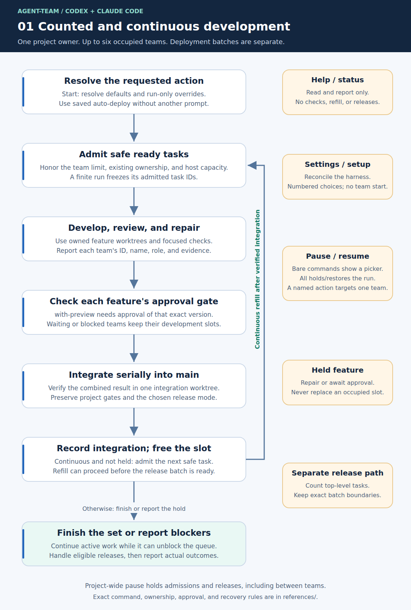
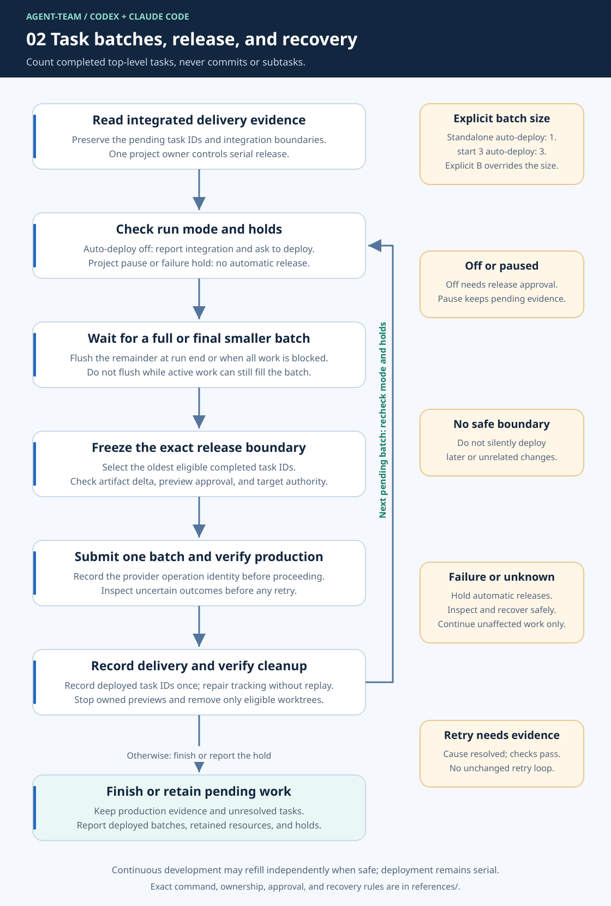

# Agent-Team

Created by [thebpandey](https://github.com/thebpandey).

Codex and Claude Code spin up a team of agents to get the job done faster and more efficiently. Agents work in a review-remediate loop to ensure clean, efficient code.

Agent-Team is a development skill for **Codex and Claude Code**. A skill is a set of instructions for an AI agent. The host is the app that runs the agent.

Give Agent-Team a task. It selects a suitable team, records progress, checks the result, and reports which requirements it met. The lead agent is called the **orchestrator**. It assigns work and controls the final checks.

Tool descriptions use short sentences and consistent terms based on [ASD-STE100 principles](https://www.asd-ste100.org/STE_faq.html). Official tool names and commands keep their original form.

## Source repository

The official source for this skill is [thebpandey/agent-team on GitHub](https://github.com/thebpandey/agent-team). Use its `main` branch when instructed to download, install, or update Agent-Team, unless the user specifies another revision. This private repository requires authorized GitHub access.

When instructed to change the skill, use a checkout of this repository and preserve existing user changes. Follow the user's instructions for commits, pushes, and installation updates. An installed copy can differ from the source; compare it before replacing files. Changes to the repository do not automatically update installed Codex or Claude Code copies.

## Skill version

The current skill version is **6.2.0**. The authoritative value is `metadata.version` in `SKILL.md`; the [changelog](CHANGELOG.md) records release changes. Run `$agent-team help` in Codex or `/agent-team help` in Claude Code on each machine to display that installed copy's version. Setup and status also display it.

To check whether a copy is current, ask the agent to compare its installed version with `SKILL.md` on this repository's `main` branch. This requires GitHub access. A displayed version alone is not a remote update check. Local modifications can differ even when version numbers match; compare package files or the Git revision when exact equality matters. Refresh the host after updating so it loads the new instructions.

For each skill release, update `metadata.version`, this README, and the changelog together before publishing. Use MAJOR.MINOR.PATCH: increase PATCH for fixes and wording changes, MINOR for compatible new capabilities, and MAJOR for incompatible workflow changes. Never publish changed skill contents under an existing released version. Install the complete package on each machine; editing the version number alone does not update the skill.

## Lifecycle hooks

Agent-Team includes optional cross-runtime lifecycle hooks for Codex and Claude Code. They normalize host events, check deterministic ownership and release prerequisites, add focused warnings, save small recovery checkpoints, and validate the package. They do not replace agent judgment or independent review. See the [lifecycle hook guide](references/hooks.md) for behavior, limits, commands, installation paths, trust, tests, and rollback.

The hooks use Node.js 24 standard-library modules only. The installer preserves unrelated host settings and keeps one authoritative Codex skill at `~/.agents/skills/agent-team`. Run installation only with the user's authority. Health reports installation, registration, trust, runtime support, and observed exercise separately.

## Install

Running `agent-team setup` checks dependencies and then shows project settings. Keep the current defaults or edit parallel teams, continuous mode, auto-deploy, and deployment batch size in the same flow. Settings changes apply to future starts.

Install this repository as the `agent-team` skill using your host's supported skill installer. The repository root contains `SKILL.md` and its supporting references.

For an authorized ZIP installation, extract the package and place its `agent-team` folder in the selected host's skill directory. The final path must be `agent-team/SKILL.md`, not an extra nested archive folder. Include `references/`, `agents/`, `assets/`, and `LICENSE`; do not copy only SKILL.md. Inspect an existing installation before replacing files and preserve user changes. Restart or refresh the host as required for discovery. Claude's native role definitions still need the setup step described below.

Build distribution ZIPs from an identified committed revision with an `agent-team/` archive prefix. Include that revision's current license and record its full commit ID and archive checksum with the package. Keep packages private and distribute only through authorized LearnStack OS channels. A repository update does not update existing extracted installations automatically.

### Installation package

The installable package contains:

```text
agent-team/
  SKILL.md
  README.md
  LICENSE
  CHANGELOG.md
  agents/openai.yaml
  references/
  assets/
  hooks/
```

This includes the command rules, project settings, continuous runs, deployment batches, lifecycle hooks, solid wordmark, 74-character message borders, platform adapters, Claude agent definitions, and workflow diagrams. External dependencies and model access are not bundled. The installation ZIP excludes the inactive `legacy/` directory and maintenance `tests/` directory.

Maintainers can build and verify both runtime packages from a clean source checkout with these commands:

```bash
package_revision=$(git rev-parse --verify HEAD)
node hooks/agent-team-cli.mjs check-package
node hooks/agent-team-cli.mjs build-artifacts --revision "$package_revision" --output ../agent-team-artifacts
node hooks/agent-team-cli.mjs check-artifacts --revision "$package_revision" \
  --archive ../agent-team-artifacts/agent-team-codex-6.2.0.zip \
  --archive ../agent-team-artifacts/agent-team-claude-6.2.0.zip
sha256sum ../agent-team-artifacts/*.zip
```

On macOS, use `shasum -a 256 "$package_archive"` for the checksum. Save the full revision and checksum with the archive. Verify archive integrity, required files, and relative links before distribution. A local package is not automatically a GitHub Release asset; do not advertise a download until it exists at an authorized destination.

### Update an existing installation

First determine whether the installed directory is a Git clone, a symlink, or an extracted copy. Preserve custom changes and keep one active installation per host and scope.

- **Git clone:** confirm its remote is this private repository and inspect its branch and local changes. For a clean installation on `main`, fetch and fast-forward from `origin/main`. Do not reset away local edits.
- **Symlink:** update its identified source checkout. Do not create a second writable copy beside it.
- **Extracted ZIP:** compare the existing files with the new package, preserve custom changes, and replace the intended installation with the complete package, including its current `LICENSE`.

Refresh or restart the host, then run `$agent-team help` in Codex or `/agent-team help` in Claude Code to check discovery. Run `setup` when dependencies or native Claude definitions need updating. Preserve customized Claude definitions and verify their registration before dispatch. Updating the source repository or creating a ZIP does not update installed copies or the separate ChatGPT-managed installation.

### Codex and Claude Code installation

For Codex CLI on macOS/Linux, a manual user-wide installation is:

```bash
mkdir -p ~/.agents/skills
git clone https://github.com/thebpandey/agent-team.git ~/.agents/skills/agent-team
```

If that destination already exists, inspect and update your existing installation instead of cloning over it. Use the current host documentation for other installation locations or operating systems. ChatGPT-managed skill installation is separate from installing into your own laptop/server.

With explicit user-wide installation authority, register the lifecycle hooks and copy the Claude package from this inspected source:

```bash
node ~/.agents/skills/agent-team/hooks/agent-team-cli.mjs install \
  --source ~/.agents/skills/agent-team
node ~/.agents/skills/agent-team/hooks/agent-team-cli.mjs health
```

The installer preserves unrelated host settings. It reports trust separately. Complete the host's native `/hooks` trust action when required.

Select GPT-6 Astra with high reasoning in Codex, then invoke:

```text
$agent-team setup
$agent-team Add the requested feature, verify it, and reconcile every requirement.
```

For **Claude Code** on macOS/Linux, the managed installer above creates `~/.claude/skills/agent-team`. To use a separate manual installation instead, inspect the destination before you clone or copy the same repository there. Then start Claude Code with the selected model:

```bash
claude --model claude-fable-5-1 --effort high
```

Then invoke:

```text
/agent-team setup
/agent-team Add the requested feature, verify it, and reconcile every requirement.
```

For project scope, use `.claude/skills/agent-team` instead. Setup also provisions the bundled native agent definitions in `.claude/agents/`, or the selected user scope, without overwriting existing definitions. Verify that Claude discovers them; a refresh or new session may be needed. Installation paths and invocation follow [Claude's skill documentation](https://code.claude.com/docs/en/skills).

Fable 5.1 requires Claude Code v2.1.255+ and account/provider access. Opus 5 with high effort is the disclosed orchestration fallback if Fable is unavailable or its usage-credit choice is declined. A skill cannot switch its parent model, grant model access, or accept purchases. See [Claude model configuration](https://code.claude.com/docs/en/model-config).

In ChatGPT, select Agent-Team from available skills or use its supported mention. ChatGPT installation does not install it on a laptop/server. Keep only one active installation per host/scope; inspect an existing destination before updating it.

Both platforms use the same main instructions and tool list. Agent-Team loads the instructions for the current host. Claude agent definitions are included. Codex uses its available agent controls.

## Commands

These are instructions understood by Agent-Team, not new commands added to the host's terminal. Codex uses `$agent-team`; Claude Code uses `/agent-team`. Clear plain-language requests such as “agent team start” also work.

Run `$agent-team help` for the full command list and examples. `auto-agent start` is also accepted as a plain-language alias for `agent-team start`. Help, start, resume, settings, setup, and status display the [solid AGENT-TEAM wordmark](references/wordmark.md) once per user invocation; continuous refills do not repeat it. Every message uses `==========================================================================` top and bottom borders and a team ID/name/role or Project Orchestrator header; see [message formatting](references/output.md).

| Command in Codex | What happens |
| --- | --- |
| `$agent-team help` | Show available commands, their meaning, and examples without starting work. |
| `$agent-team settings` | View or change this project's defaults for team count, continuous mode, auto-deploy, and deployment batch size. |
| `$agent-team setup` | Check dependencies and offer installation choices. |
| `$agent-team start` | Use project defaults. Without saved settings, select one ready, unassigned task; preserve its task ID and assign a stable team ID/name. |
| `$agent-team start 3` | Start up to three safe independent tasks. Without continuous mode, finish only the admitted set, integrate it, and ask whether to deploy when auto-deploy is off. |
| `$agent-team start continuous` | Refill a slot after successful verified integration into main. The default team limit is one. |
| `$agent-team start 3 continuous` | Keep up to three occupied development teams, refilling after each successful integration. |
| `$agent-team start 3 auto-deploy` | Start up to three tasks and deploy the three completed tasks together. |
| `$agent-team start 3 continuous auto-deploy` | Refill up to three teams while deploying batches of three completed top-level tasks. |
| `$agent-team start 3 continuous auto-deploy 2` | Keep up to three teams; deploy every two completed top-level tasks. |
| `$agent-team start 3 no-continuous no-auto-deploy` | Override saved defaults for this run: one fixed set, then ask before deployment. |
| `$agent-team auto-deploy` | Enable current-run deployment of each integrated task, one at a time; start no new teams. |
| `$agent-team auto-deploy 3` | Enable current-run batches of three, including eligible tasks already integrated but not deployed. |
| `$agent-team auto-deploy off` | Stop future automatic batches without changing saved defaults. |
| `$agent-team start with-preview` | Use project run defaults and require your preview approval for each admitted task before integration. |
| `$agent-team start email-preferences with-preview` | Start the named feature, provide a local preview, and wait for your approval before integration. |
| `$agent-team status` | Report the current team's progress, or the project overview from a project session. Do not interrupt development. |
| `$agent-team status email-preferences` | Report one team's tasks, progress, blockers, preview, and release state. A team ID such as TEAM-002 also works. |
| `$agent-team status all` | Report all teams and unassigned work in the current project. |
| `$agent-team pause` | Show in-progress teams and All; wait for your selection before pausing. |
| `$agent-team pause all` | Safely pause all in-progress teams in this project without a picker. |
| `$agent-team pause email-preferences` | Save progress and safely pause that team. Preserve its unfinished files. |
| `$agent-team resume` | Show paused teams and All; wait for your selection. Interrupted teams are clearly labeled when present. |
| `$agent-team resume all` | Recover all paused or interrupted unfinished teams in this project without a picker. |
| `$agent-team resume email-preferences` | Recover only the named team. |
| `$agent-team approve email-preferences` | Approve the submitted preview version for integration. Existing integration and deployment checks still apply. |

`start` creates new work; it does not resume other teams. Team limits are integers from 1 to 6. A fixed run admits up to that many safe tasks and does not replace completed teams. Continuous mode refills each slot only after its whole selected task is verified and successfully integrated into main. Waiting for preview approval, blocked, paused, or interrupted teams still occupy slots. Host capacity and dependencies may reduce the actual parallel count. No ready tasks means no invented work. A named start remains limited to that feature regardless of saved count/continuous settings. `resume` preserves team identities, run choices, and gates and checks for surviving writers.

### Project defaults and deployment batches

Built-in defaults are one team, continuous off, and auto-deploy off. `settings` saves defaults only for the current project in the existing local setup receipt. Explicit command values override those defaults for one run. Settings changes do not alter an active run. If a start inherits auto-deploy from saved settings, Agent-Team tells you the setting and asks whether to keep it or use no auto-deploy for this run before starting. An explicit `auto-deploy` modifier skips that settings question. Existing target and release gates still apply.

Deployment batches count completed top-level tasks, regardless of their commit or subtask count. Standalone `auto-deploy` uses a batch size of one. On a start, `auto-deploy` without a number uses the effective team limit. An explicit batch size overrides that value. Continuous refill does not wait for deployment: a newly integrated task frees its slot while it waits for its release batch.

Each batch uses an exact verified integration boundary so later changes on main cannot enter an earlier batch. A final smaller batch deploys when the admitted work finishes or only blocked work remains, provided auto-deploy is enabled and release gates pass. A project pause or deployment-failure hold prevents that final flush. Without auto-deploy, Agent-Team reports the integrated result and asks whether to deploy.

After a deployment failure, automatic releases stop while authorized recovery runs. Independent development can continue if the failure is confined to the deployment service; affected work pauses if code or shared integration is implicated. Another automatic release requires evidence that the cause is resolved and release checks pass. A successful external action is never repeated merely to repair a missing tracker update.

See [run scheduling](references/runs.md), [project settings](references/settings.md), [command help](references/help.md), and [release batches](references/release.md).

### Named teams and work folders

A team has a stable number such as `TEAM-001` and a readable name such as `lesson-progress`. Session replacement does not change its team number. The project keeps one directory of team identities and one authoritative task tracker. Each task has one implementation owner. Independent team sessions depend on host support; otherwise, one orchestrator can manage named developer groups without claiming independent sessions.

The main checkout is used for project initialization, planning, and shared records. All later feature changes use separate worktrees. The project orchestrator combines branches one at a time in a separate integration worktree, checks the combined result, then updates main through the established merge process. It does not merge just because a feature team reports success.

### Status without interruption

Status reads recorded progress. It does not ask agents for fresh reports, run tests, change tasks, or pause work. It shows the source and age of the information. Active work continues where the host supports it; the orchestrator may briefly use a turn to answer.

| Team | Total | Completed | In progress | Not started | Blocked | Remaining | Complete |
| --- | ---: | ---: | ---: | ---: | ---: | ---: | ---: |
| TEAM-001 / lesson-progress | 10 | 6 | 2 | 1 | 1 | 4 | 60% |
| TEAM-002 / email-preferences | 8 | 2 | 3 | 3 | 0 | 6 | 25% |
| Project total | 18 | 8 | 5 | 4 | 1 | 10 | 44% |

This is an example. Completion is completed tasks divided by included tasks. Remaining includes active and blocked tasks. Count actionable tasks once; exclude summary groups, cancelled tasks, and approved deferrals. Show unassigned and unknown work when present. Zero tasks means N/A. This measures tasks, not time or effort. Approval and production status are reported separately.

### Preview before integration

`with-preview` creates a required approval gate. The team uses the project's existing development or preview command and its own available port. It checks the page and gives you the address, review version, and feature summary. The source remains stable while you review it.

Passing tests does not replace your approval. If the preview fails, integration stays blocked. Feedback produces a new review version. Material changes after approval require renewed approval. Pause and resume preserve this requirement. Approval permits integration of that version, not an unchecked production deployment.

A development preview is not a production deployment. `localhost` refers to the machine running the server. Viewing a server preview from another device needs an approved private address or tunnel. The harness does not expose ports publicly without authorization.

### Recovery and required cleanup

Bare `pause` and `resume` first show a team picker with an All option. Pause lists in-progress teams; resume lists paused teams and clearly labels any interrupted work. This applies even from a feature session or when only one team is available. Nothing changes until you choose. Cancelling leaves work unchanged. Explicit `pause all` and `resume all` act directly; an explicit name or ID affects only that team. The lead stops new assignments and integrations, saves checkpoints, and reports each team's result. Operations that cannot safely stop are reported as still stopping or unknown. The harness does not claim a complete pause until the affected writers and release activity have stopped safely. It preserves worktrees, preview approval, and safely running previews with frozen source. Other projects are unaffected.

`pause all` also stops continuous refill and new automatic batches until project resume, including between tasks. A bare picker includes an eligible run when no teams are eligible. All selected there controls that run and the offered teams. A named resume does not clear a project-wide hold. Resume restores effective run settings and pending deployment batches from evidence; it does not reload changed defaults or repeat an already answered settings confirmation.

Each agent saves short checkpoints during meaningful progress and before a requested pause. Resume reads those notes, current files, task evidence, active processes, approval gates, and release records. It checks whether earlier agents are still writing before replacing them. If deployment already succeeded, it records the result and continues remaining verification or cleanup instead of deploying again.

After successful production verification, cleanup is required. Stop task-owned previews and processes, preserve needed evidence, and remove all eligible feature and child worktrees, including their disposable build files and local dependency folders. Reuse at most one integration worktree while it is needed; remove it when idle and eligible. Preserve main, unfinished work, user files, and shared resources. Record retained worktrees and failed cleanup so resume can finish it. Report recovered disk space only when measured.

A skill cannot guarantee a final checkpoint after a crash or recover code from a lost temporary workspace. It also cannot keep servers or agents running after the host stops unless the host provides that capability.

See the [action rules](references/actions.md), [team coordination](references/projects.md), [recovery procedure](references/recovery.md), [status rules](references/status.md), and [preview gate](references/preview.md).

## How Agent-Team works

The first flowchart shows command routing, counted/continuous development, and preview approval. Remediate means to repair a problem found during review. A lead can handle small feature work in its assigned feature worktree. Larger tasks use developers and one focused review.

[](assets/diagrams/setup-development.svg)

[Open the full-size flowchart](assets/diagrams/setup-development.svg) · [Mermaid source](assets/diagrams/setup-development.mmd)

Agent-Team uses Beads or one local `TASKS.md` file. If any recommended tool is missing or declined, it uses the local file. Each agent saves short resume notes in its assigned `CONTEXT.md` file. The task record holds progress and failure history.

After two attempts without useful progress, the lead agent changes the approach or assigns a more capable developer. It does not repeat the same failed attempt. If the new approach also fails, it asks one focused question or reports the blocker.

The second diagram shows serial integration, release, recovery, and required cleanup. **Deployment** means publication of a checked app version to the intended destination. **Rollback** means restoration of an earlier working version.

[](assets/diagrams/release-recovery.svg)

[Open the full-size flowchart](assets/diagrams/release-recovery.svg) · [Mermaid source](assets/diagrams/release-recovery.mmd)

Installation does not grant deployment permission. Auto-deploy uses the run's explicit command or confirmed saved preference and established target authority. With auto-deploy off, Agent-Team asks before deploying the integrated result. It restores an earlier version only when authorized and safe. It does not automatically reverse destructive data changes. If recovery fails, it stops further releases and reports the incident.

After every successful release or recovery, Agent-Team updates the active task record. A recovery does not mean that the requested feature is complete. Before work-folder removal, it preserves required evidence and checks that the work is deployed and verified. It keeps the main folder, unrelated work, and unfinished work.

## Pro quality and project memory

This repository includes the full package that forms the basis for Pro. Agent Team Lite is a separate edition. Counted/continuous runs, task-based auto-deploy, project run settings, and the Pro features below are excluded from Lite.

| Feature | What it does |
| --- | --- |
| [Visual browser review](references/visual-review.md) | A reviewer opens the app and inspects desktop and mobile screenshots. It checks the changed screens against the agreed design. |
| [End-to-end acceptance tests](references/acceptance-tests.md) | Checks that a main user task works through the connected app, including the saved result when needed. |
| [Explanations beside code](references/code-explanations.md) | Adds short, plain-English explanations of a feature's purpose and important rules. Updates a feature guide when several files or setup steps need explanation. |
| [Shared mistake lessons](references/mistakes-memory.md) | Keeps confirmed agent mistakes, corrections, and prevention steps in one project `MISTAKES.md` file. |

These checks use the existing review and repair loop. A separate visual tester is optional for substantial screen changes. Browser review uses supported host tools or a suitable available tool such as Playwright or Agent Browser. Capturing screenshots without inspecting them does not complete visual review. Simulated tests do not prove that the real app integration works. Unavailable checks are reported as blocked.

For each feature, the developer adds or updates the nearby explanation and reports its location in the task record. The existing reviewer checks that it matches the code. Small changes do not require a separate feature guide or documentation review pass.

All teammates read relevant mistake lessons before work and retries. Only the lead agent updates the shared file. Repeated mistakes update an existing lesson. Old advice is corrected or marked as superseded. This file supplies project context; it does not train the model.

| Record | Purpose |
| --- | --- |
| Beads or `.agent-team/TASKS.md` | Requirements, ownership, task status, attempts, and verification evidence. |
| Each agent's `CONTEXT.md` | Short resume notes and the next action. |
| Main project `MISTAKES.md` | Confirmed mistakes and actions that help prevent repeats. |

## First-run setup

A dependency is a tool or skill that helps Agent-Team do a task. Agent-Team checks what is installed before it offers changes. It explains each tool in simple terms.

| Choice | What happens |
| --- | --- |
| Recommended tools for this project | Install the accepted recommended tools and useful optional tools. |
| All free tools that work here | Install accepted free skills and reference files. Add app packages only where needed. |
| Choose tools or skip installation | Install selected items, or continue without new tools. |

Before installation, you see the source, version, location, and proposed changes. Agent-Team remembers declined tools. It does not ask about them again unless you change the choice. It checks each selected installation before use.

A package is software that you can install. Some packages work only with specific app software. A collection can contain many separate components. Agent-Team adds only the needed parts. Paid features require existing access. Installation cannot bypass permissions or required approvals.

See the [setup procedure](references/setup.md) for exact installation rules.

## Recommended tools

These tools are recommended, not mandatory. You can decline any of them and continue with the local task file.

| Tool | What it does | When Agent-Team uses it |
| --- | --- | --- |
| [Ponytail](https://github.com/DietrichGebert/ponytail) | Helps the agents write simple code that meets the task requirements. | All agents use it when available and enabled. |
| [Using-Superpowers](https://github.com/obra/superpowers) | Gives the agents procedures to plan, build, find faults, and check their work. | All agents use the procedures that apply to their tasks. |
| [Beads](https://github.com/gastownhall/beads) | Stores tasks, task owners, progress, and records of failures. Shows which tasks must finish before other tasks can start. | Use it when Beads is selected and all four recommended tools are ready. Keep an existing local-file choice until changed. |
| [Impeccable](https://github.com/pbakaus/impeccable) | Helps the agents design and check clear, consistent app screens. | Use it for screen design, layout, and user controls. |


Every teammate uses the available skills selected for its task. Missing skills are not reported as used.

## Optional design tools

UI means the screens and controls that a person uses. UX means how easy the product is to understand and use. A component is a reusable screen part, such as a button.

React is software for building app screens.

Agent-Team offers all the options below during setup. It explains which ones fit the project.

| Tool | What it does | Use it when |
| --- | --- | --- |
| [UI UX Pro Max](https://github.com/nextlevelbuilder/ui-ux-pro-max-skill) | Gives the agents searchable examples of colors, fonts, and screen layouts. | A new design needs more reference examples. |
| [UI Skills](https://github.com/ibelick/ui-skills) | Provides a collection of separate design instructions. | One of those instructions helps with the current task. |
| [shadcn/ui](https://ui.shadcn.com/docs/installation) | Provides screen parts, such as buttons, forms, and menus. | The app needs reusable controls and supports this tool. |
| [Magic UI](https://github.com/magicuidesign/magicui) | Provides ready-made visual effects and screen parts with movement. | An effect helps explain or improve part of the page. |
| [Motion](https://motion.dev/docs) | Adds controlled movement to screen parts. | Simple built-in page styles cannot provide the required effect. |
| [React Bits](https://github.com/DavidHDev/react-bits) | Provides visual effects for text, backgrounds, and user controls in React apps. | The app needs a specific effect and meets the license conditions. |
| [Taste Skill](https://github.com/Leonxlnx/taste-skill) | Gives design instructions for a distinct visual style. | A landing page, portfolio, or major redesign needs more design direction. |
| [img2threejs](https://github.com/img2threejs/img2threejs) | Helps build a 3D scene from reference images. | Users need to view or interact with a 3D object. |
| [Awesome DESIGN.md](https://github.com/VoltAgent/awesome-design-md) | Provides written examples of colors, fonts, spacing, and layouts. | The agents need a useful design reference. This is a reference collection, not a program. |
| [Bklit UI](https://bklit.com/docs/skills) | Provides charts for app screens. | A dashboard needs to show measurements, totals, or changes over time. |


These tools are optional. Agent-Team does not install whole component collections or add unused packages. Motion+ features and Bklit Studio are separate products. React Bits has additional Commons Clause license conditions. Agent-Team does not automatically select the separate GPT-specific Taste variant.

See the [tool guide](references/dependencies.md) for tools needed by specific tasks, such as Git, Node.js, and Python. See the [UI procedure](references/ui.md) and [optional design guide](references/ui-optional.md) for selection rules.

## Team and workflow

| Role | Codex | Claude Code |
| --- | --- | --- |
| Project/team orchestrator; small work in feature worktree | GPT-6 Astra, high | Fable 5.1, high |
| Standard developer | GPT-5.6 Terra, medium/high | Opus 5, high |
| Independent reviewer | GPT-5.6 Terra, medium/high | Opus 5, high |
| Pro visual and acceptance judgment | GPT-5.6 Terra, high | Opus 5, high |
| Complex developer | GPT-5.6 Sol, high; xhigh when warranted | Opus 5, xhigh |
| Routine developer and defined checks | GPT-5.6 Luna, low/medium | Sonnet 5, high |
| Optional simple text rewrite/paraphrase | Usually direct or Luna | Haiku 4.5, no effort override |

Claude routing uses **Opus xhigh for Sol-level work**, **Opus high for Terra-level development and review**, and **Sonnet high only for Luna-level work**. “Extra effort” means the native `xhigh` setting. If a required tier is unavailable, the harness reports it instead of silently downgrading. Haiku is limited to menial text transformations, never coding, investigation, testing, review, planning, or release decisions. Tiny rewrites may stay with the orchestrator to avoid dispatch overhead.

Claude selections were checked on 2026-09-04 against [Anthropic's model overview](https://platform.claude.com/docs/en/models/overview). This is a recommended role mapping, not a claim of benchmark equivalence. Exact IDs, supported effort, and availability handling are in the [Codex adapter](references/platform-codex.md) and [Claude adapter](references/platform-claude.md).

The lead handles small feature changes in a feature worktree when a teammate would add unnecessary work. Larger changes normally use a developer and one independent reviewer. A worktree is a separate project folder managed by Git. Developers use separate worktrees for independent changes. Reviewers can reuse a stable folder. Agent-Team does not create judge panels.

Beads or the local `TASKS.md` file holds the task record. In local-file mode, only the lead agent writes task updates. Teammates send their results to the lead agent. Each `CONTEXT.md` file holds short resume notes, not a second task list. Checks cover changed behavior, common failures, and project requirements.

## Deployment and cleanup

The release diagram above shows the main decisions. Agent-Team checks the combined changes before release and checks the live app afterward. It records results before it removes completed work folders. It reports the result for every user requirement.

A skill does not run after its host stops. Use the deployment service's own health checks and recovery features when available.

## Repository layout

- `SKILL.md`: shared entrypoint; selects the adapter for the actual host.
- `agents/openai.yaml`: OpenAI display metadata; ignored by Claude.
- `assets/claude-agents/`: installable Opus developer/reviewer and complex developer, Sonnet routine developer, restricted Haiku text assistant, and Pro visual tester definitions.
- `references/`: platform adapters and conditional setup, dependency, team, state, UI, release, run scheduling, settings, help, message formatting, wordmark, recovery, status, and preview-approval instructions.
- `tests/command-scenarios.md`: command interpretation scenarios for instruction validation; not live host or deployment tests.
- `legacy/claude-v3/`: preserved previous Claude workflow, inactive and not part of the current installation instructions.
- `CHANGELOG.md`: release history.

The former `astra-dev-harness` personal skill is renamed `agent-team`; avoid keeping two active copies. This private repository is the source for authorized LearnStack OS distribution. Updates to an installed personal copy are explicit, not automatic two-way synchronization.

## Validation and license

This is an instruction-based skill. Structure, native agent frontmatter, internal links, and workflow consistency are checked; model routing, third-party installers, and production recovery still depend on the actual host/project and must be verified there. No universal cross-platform installation guarantee is made.

[LearnStack OS Proprietary Skill License](LICENSE). This release is available to users with a qualifying paid LearnStack OS entitlement. Modification, redistribution, sharing, and resale of the skill are restricted by that license. Third-party materials retain their separate licenses.
