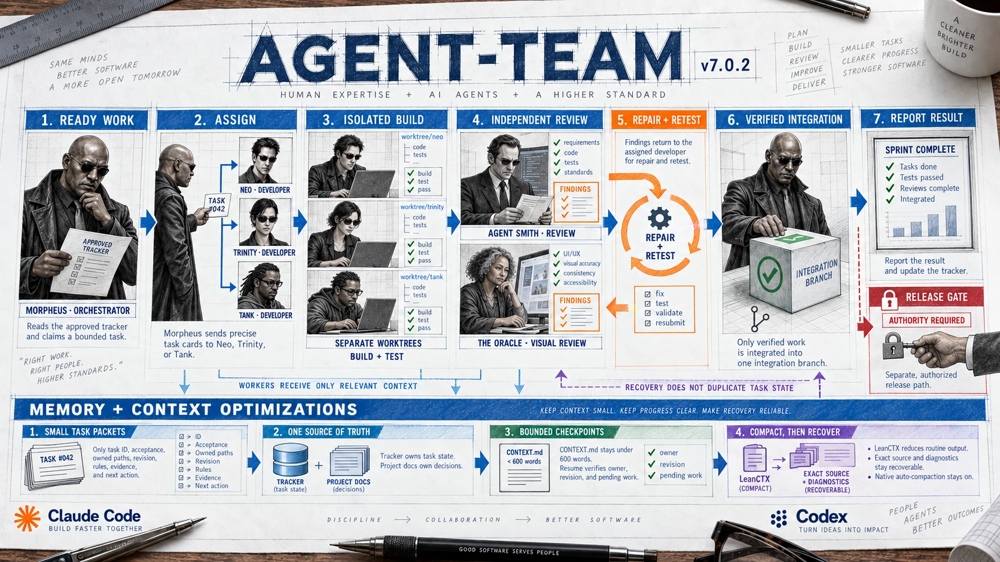
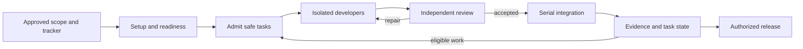
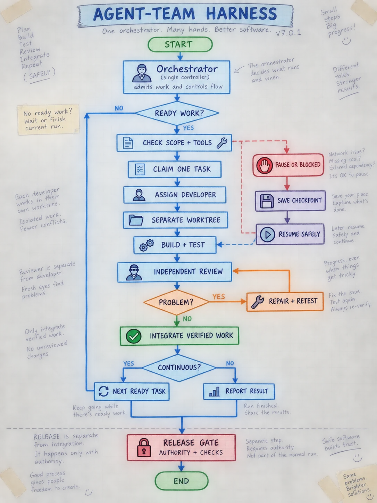

# Agent-Team

Created by [thebpandey](https://github.com/thebpandey). Agent-Team coordinates bounded development in Codex and Claude Code with isolated writers, independent review, verified integration, durable recovery, and explicit release authority.

The native version is **[v8.0.10](https://github.com/thebpandey/agent-team/releases/tag/v8.0.10)**. It publishes verified native downloads for Linux amd64 and Windows amd64; macOS source checks do not imply a published macOS binary. The historical Node package **v7.3.1** described in older sections is retained only for its historical runtime contract. The repository-root `SKILL.md` routes to this native release and is not the Node runtime. For release history, see the [changelog](CHANGELOG.md); for the compact operator walkthrough, see [Getting Started](GETTING_STARTED.md).

## vNext native transition

External Ed25519 trust is not part of normal Agent-Team setup or use. It is a one-time fallback only for stale or unverifiable v7 cutover without a current canonical approval; fresh v8 projects and valid schema-4 receipt migrations do not require it. One machine trust key may sign separate short-lived, project-bound approvals.

For that fallback only, an authorized Linux operator may run `sudo bash scripts/provision-cutover-trust.sh`; it refuses existing keys or trust stores and performs no signing, cutover, or publication.

Install one checksum-verified native package and select the host explicitly: `agent-teamctl install --host codex|claude|both`. With no host variables, Codex uses `~/.agents` and Claude uses `~/.claude` on Windows, macOS, and Linux. Set `CODEX_HOME` or `CLAUDE_HOME` only on the first install for a custom location; the manifest preserves each resolved home for later update, rollback, and uninstall commands. A conflicting later override fails closed. Switching hosts is a foreground action and transfers no lease or worker identity. `rollback --version <version>` selects a unique release backup; add `--revision <commit>` when that version has multiple revisions. Rollback and `uninstall` touch only exact manifest-owned bytes and retain changed or unknown files.

The public lifecycle is `setup`, `status`, `start`, `task add`, and `one-off`, plus scoped `pause`, `stop`, `cancel`, and `resume`. FIX/CLEAN is an internal independent-review loop, not a public `review` command. Beads is the live tracker after an approved cutover; a pre-cutover `TASKS.md` is legacy provenance only. `BLOCKERS.md` and `DECISIONS.md` are bounded human-readable projections, never competing task stores.

Native v8.0.10 settings use `agent-teamctl settings --json` to inspect the saved overlay and `agent-teamctl settings parallel_teams=1 --json` to save a supported change. The overlay is bound to the existing setup receipt; it does not rewrite setup, legacy state, or Beads. See [supported settings](references/SETTINGS.md) for the bounded key and host-profile contract. Saving a preference does not change an active worker or prove that a host can enforce a model choice.

In Codex, `agent-teamctl start --json` admits at most one ready task by default and returns a packet requiring host dispatch. The installed Codex skill must call the actual host collaboration tool and acknowledge its returned identity before reporting a launch. Explicit bounded queues use the existing team queue, with no new task store. A retained team receives its next assignment only after completion, independent CLEAN review, and observed idle state. Reuse sends a fresh bounded packet to the same host handle, not the full previous context. A standalone terminal command does not itself launch Codex agents, and this release does not add a Claude team-dispatch bridge.

Existing v7 projects and hosts use the explicit native transaction `agent-teamctl cutover --request /absolute/path.json`. Start with the read-only `prepare` request described in `GETTING_STARTED.md`; it emits an exclusive canonical unsigned payload and detached-signature request skeleton while inventorying the project, independently observed remote, evidence, staged native install, and both legacy hosts. The v7 state and operation receipts are writable integrity records, not an immutable authorization root, so project cutover accepts only a short-lived Ed25519 approval whose signer is pinned outside the project. The fixed trust store is `/etc/agent-team/cutover-trust.json` on Unix and `C:\ProgramData\Agent-Team\cutover-trust.json` on Windows; it must be owned and writable only by root, Local System, or Administrators, schema 1, and contain a key-ID-sorted `keys` array. Unknown Windows ACL entries or reparse points fail closed. There is no v7-receipt, project-local, unsigned, or request-pinned fallback. The signed record binds project, operation, exact revision and task scope, canonical review/test/readiness IDs, paths and SHA-256 digests, recovery, configured remote URL/refs, and exact host activation inventory. The transaction observes that remote independently before mutation and again before receipt publication. The first project pass remains held; `reconcile` and rollback must match the recorded approval and receipt digest. Host requests are `host-cutover`, `host-status`, or `host-rollback`; they accept either the exact schema-4 v7 install receipt or an explicit canonical project plus the SHA-256 of its fixed, matching signed authority receipt—never a caller-selected receipt path or inventory—and preserve a durable rollback receipt. Unknown, modified, cross-project, or ambiguous v7 files and handlers are retained and fail closed.

A legacy project that already uses Beads keeps its selected `.beads` tree in place. Native prepare, cutover, and rollback add only separate v8 authority and prepared-request artifacts; they do not convert, delete, rewrite, or re-home Beads files.

The dashboard is local-only and read-only. Capacity caps remain enforced. Optional Serena, Graphify, LeanCTX, browser, and visual tools have bounded native fallbacks; absence never widens authority. See the [honest v8 benchmark report](https://github.com/thebpandey/agent-team/blob/main/docs/benchmarks/vnext-optional-8.0.0.md) and the [v8.0.10 revision-bound release checks](https://github.com/thebpandey/agent-team/blob/main/docs/releases/8.0.10-readiness.md) before treating a candidate as published.

Linux amd64: download `agent-teamctl-8.0.10.zip`, `RELEASE.json`, `SBOM.cdx.json`, and `SHA256SUMS` from the release into one empty folder. Run `sha256sum -c SHA256SUMS`, extract `agent-teamctl-8.0.10.zip` into that folder, then run `./agent-teamctl install --host both --json`. Use `codex` or `claude` instead of `both` to install one host.

Windows amd64: download only `agent-teamctl-8.0.10-windows-amd64.zip` and its `.sha256` sidecar. In PowerShell, verify the sidecar with `Get-FileHash -Algorithm SHA256`, extract the ZIP once into a new subfolder, then run `.\agent-teamctl.exe install --host both --json` from that extracted folder. Use `codex` or `claude` instead of `both` to install one host. The extracted folder contains the executable, the strict canonical release files, and the inner archive.

If install or update reports a conflicting Codex Agent-Team skill, it has not changed the target installation. Move the reported whole root to a recoverable backup outside `~/.codex/skills` and `~/.agents/skills`, then retry. Do not merge files from an unknown root into the native installation.



## What Agent-Team does

Agent-Team keeps one project orchestrator responsible for scope, task admission, coordination, integration, and release. Developers work on bounded assignments in separate worktrees. Independent reviewers verify exact revisions. Ordinary in-scope failures return to the owning developer for repair; they do not become repeated permission prompts.

One selected Beads tracker or one root/designated `TASKS.md` owns task state. Checkpoints, dashboards, setup receipts, plugins, and LeanCTX never become competing task stores. Unknown readiness, liveness, trust, or model availability stays unknown.


```mermaid
flowchart LR
  A["Approved scope and tracker"] --> B["Setup and readiness"]
  B --> C["Admit safe tasks"]
  C --> D["Isolated developers"]
  D --> E["Independent review"]
  E -->|repair| D
  E -->|accepted| F["Serial integration"]
  F --> G["Evidence and task state"]
  G -->|eligible work| C
  G --> H["Authorized release"]
```

## Quick start

### 1. Install the package

Ask the active host to install the complete package from the official repository. Choose the actual host and scope explicitly; installing for both hosts is never inferred.

```text
Install the historical Node package Agent-Team 7.3.1 from https://github.com/thebpandey/agent-team.
Use the managed installer for this host and user scope unless I explicitly choose project scope.
Inspect the source, license, existing installation, and affected hook configuration first.
Preserve custom files, role definitions, hooks, MCP servers, and unrelated settings.
Verify the installation receipt and tell me which reload or native trust step remains.
```

| Scope | Codex | Claude Code |
| --- | --- | --- |
| User | `~/.agents/skills/agent-team` | `~/.claude/skills/agent-team` |
| Project | `.agents/skills/agent-team` | `.claude/skills/agent-team` |

Project hooks use `.codex/hooks.json` or `.claude/settings.local.json`; user hooks use `~/.codex/hooks.json` or `~/.claude/settings.json`. Restart or reload the selected host after installation and review its native hook-trust UI. A skill cannot grant native trust to itself.

### 2. Run setup

Invoke `$agent-team setup` in Codex or `/agent-team setup` in Claude Code. Setup:

1. resolves the canonical project and selected tracker;
2. reuses an approved Project Kickoff handoff, an existing plan, or a bounded standalone task;
3. prepares selected companion capabilities;
4. reports installed, detected, functional, and fresh-worker observations separately;
5. shows the current-effective settings wizard; and
6. reports dispatch readiness without starting development.

Project Kickoff is optional. If you use it, install its current supported package from the [latest release discovery page](https://github.com/thebpandey/project-kickoff/releases/latest). Compatibility is an exact recorded handoff contract, not a guess based on version ordering.

### 3. Start work

```text
$agent-team start
$agent-team start 2
$agent-team start 2 continuous
$agent-team start 2 continuous auto-deploy 8
$agent-team start email-preferences with-preview
```

Use `/agent-team ...` for the same actions in Claude Code. A named start selects an already-defined tracker item. A full natural-language feature request may create one deduplicated canonical task only after scope and acceptance are sufficient.

## Switch between Codex and Claude Code

Host and session switching is deliberately uneventful:

```text
$agent-team setup
/agent-team setup
```

Open the same Git checkout in the other native host or a new session and continue. Re-running setup is safe and preserves the tracker, task IDs, settings, active run, claims, checkpoints, pending operations, and evidence. No release command, request file, epoch migration, owner recovery, or prior-session cooperation is required. Recorded host/session/epoch fields are audit provenance only.

The current session must still be genuine runtime metadata for Codex or Claude Code and must resolve to the same Git project. This prevents request JSON from impersonating a host; it is not a coordinator lock. Existing writers with unknown liveness remain occupied so a new session cannot create concurrent writes accidentally.

`takeover` remains a compatibility alias for older instructions but performs no ownership transfer. Legacy owner history or a stale recovery journal does not block ordinary setup, task, run, checkpoint, integration, or release operations. Model routing is independent: if a requested model is unavailable, Agent-Team reports the actual host/account constraint without rewriting role choices.

See [actions](references/ACTIONS.md), [project continuity](references/PROJECTS.md), [recovery](references/RECOVERY.md), and the [hook contract](references/HOOKS.md).

## Commands

| Action | Result |
| --- | --- |
| `help` | Show the current command card without setup or mutation. |
| `setup` | Prepare capabilities, review settings, and report readiness. |
| `takeover` | Compatibility alias: verify this native session is in the same project, then continue. |
| `settings` | Show or change targeted future-run defaults. |
| `start [N] [continuous]` | Admit existing eligible tasks within safe capacity. |
| `start <name> [with-preview]` | Start one resolved tracker item. |
| `auto-deploy [B or off]` | Change release batching for the active run only. |
| `status [name-or-ID or all]` | Read recorded state without checks or mutation. |
| `pause [name-or-ID or all]` | Checkpoint and hold selected work without discarding it. |
| `resume [name-or-ID or all]` | Recover selected work from durable evidence. |
| `pause and deploy` | Pause first, then release only eligible verified work. |
| `approve <name-or-ID>` | Approve the exact submitted preview revision. |

Settings persist for future runs. Explicit start modifiers affect the current run. Team count is development capacity, not raw agent slots; reviewer capacity and host limits may reduce concurrency. Deployment batch size counts completed top-level tasks, not commits or subtasks.

## Readiness and bundled capabilities

A path or version string is not readiness. Setup records each stage independently:

| Stage | Meaning |
| --- | --- |
| Installed | Expected files or executable are present. |
| Detected | The selected host can resolve the exact capability. |
| Functional | A useful bounded operation passed. |
| Available to worker | A fresh assigned worker used the actual scoped path successfully. |

Serena and Microsoft Playwright CLI are selected defaults, not universal dispatch gates. Other selected defaults include ast-grep, Graphify, LeanCTX, focused Superpowers procedures, Ponytail, Impeccable, and React Best Practices where applicable. Beads is prepared only when it is the selected tracker. Context7 and the optional external graph remain opt-in. Only capabilities explicitly listed by the active plan in `requiredCapabilities` can block that plan.

Serena can pass its direct MCP symbol probe while a just-created worker still needs a host reload to inherit the tool; that observation is reported as `unknown`, not treated as global failure. Browser qualification runs the exact selected `playwright-cli`; a bare `import("playwright")` inside a Node REPL is a different adapter and does not qualify or disqualify the CLI. Graphify evidence is optional: deterministic writable-path overlap checks remain authoritative when no graph evidence exists.

LeanCTX qualification uses process-local state and a target inside the assigned worktree. It does not widen the read jail with temporary roots. Impeccable uses an exact pinned guidance tree and bounded companion-file checks. Dependency preparation preserves compatible unowned installations and refuses to overwrite customized or ambiguous files.

Fresh workers load the complete applicable skill instructions and only the references needed for their assignment. A parent receipt is not proof that a child read them.

## Coordination and recovery



The canonical project keeps stable team IDs, exact worktree/branch assignments, task claims, checkpoints, and evidence pointers. Feature writers never share a writable path. Feature changes occur in worktrees and verified revisions integrate serially.

Continuous mode refills only proven-free capacity with eligible in-scope tasks. Unknown writers remain occupied. A scoped blocker parks only affected work while safe independent work continues. Status and help are read-only and do not silently resume a run.

Accepted integration evidence queues completed top-level, nondeployed deliveries in integration order, including recovered completions already scoped into the run. An incomplete top-level delivery fails closed; subtasks and epics never enter the deployment queue.

## Release safety

Integration, publication, and deployment are separate facts. A release requires the exact authorized target, revision, task set, checks, review, preview disposition when applicable, recovery evidence, and clean delta. Recorded session provenance does not make release authority session-exclusive. Forced, chained, stale, held, mismatched, or multi-ref pushes remain denied.

The historical Node package Agent-Team 7.3.1 permits an explicitly authorized manual release record to cover its named deployment-triggering non-force `origin` push to `refs/heads/main` only when every ordinary integration and release gate matches.

## Legacy v7 archive installation

Download `agent-team-7.3.1.zip` and the matching one-entry `SHA256SUMS` from the [Agent-Team v7.3.1 release](https://github.com/thebpandey/agent-team/releases/tag/v7.3.1), or discover the current package through [releases/latest](https://github.com/thebpandey/agent-team/releases/latest).

```bash
(cd /absolute/download && sha256sum -c SHA256SUMS)
node /absolute/extracted/agent-team/hooks/agent-team-cli.mjs install \
  --archive /absolute/download/agent-team-7.3.1.zip \
  --checksums /absolute/download/SHA256SUMS \
  --host codex \
  --scope user
```

Use `--host claude-code` or an explicitly authorized `--host both`. Project scope also requires `--scope project --project /absolute/project/root`. On macOS, use `shasum -a 256` on the same downloaded archive/checksum pair.

Automatic archive installation is qualified on Linux and WSL only when `/proc/self/fd` descriptor-root traversal works. Otherwise it returns `unsupported_platform`, `changed: false` before mutation. An identical reinstall changes nothing. A differing present target returns `update_requires_manual_replacement`, `changed: false`; replacement requires authorized quiescence and a rollback-backed move before a fresh absent-target installation.

The sealed `.agent-team-source.json` and schema-4 receipt bind archive identity, checksums, source revision, complete file maps, modes, sizes, host, scope, targets, roles, handlers, conflicts, backups, and recovery. Installation still does not prove native trust, event execution, dependency functionality, or worker discovery.

## Source and verification

The official source is [thebpandey/agent-team](https://github.com/thebpandey/agent-team). This historical Node package release identity is [v7.3.1](https://github.com/thebpandey/agent-team/releases/tag/v7.3.1). Licensed packages should remain outside application commits.

From a source checkout:

```bash
node --test tests/hooks-*.test.mjs
node hooks/agent-team-cli.mjs check-package --source .
node hooks/agent-team-cli.mjs build-artifacts --source . --revision <full-commit-id> --output ../agent-team-artifacts
node hooks/agent-team-cli.mjs check-artifacts --revision <full-commit-id> --archive ../agent-team-artifacts/agent-team-7.3.1.zip
sha256sum ../agent-team-artifacts/agent-team-7.3.1.zip
```

Portable tests cover package contracts and shipped Node consumers. Native registration, account/model access, trust, provider behavior, and real browser operations remain separately reported host facts; they block only work that explicitly requires them.
