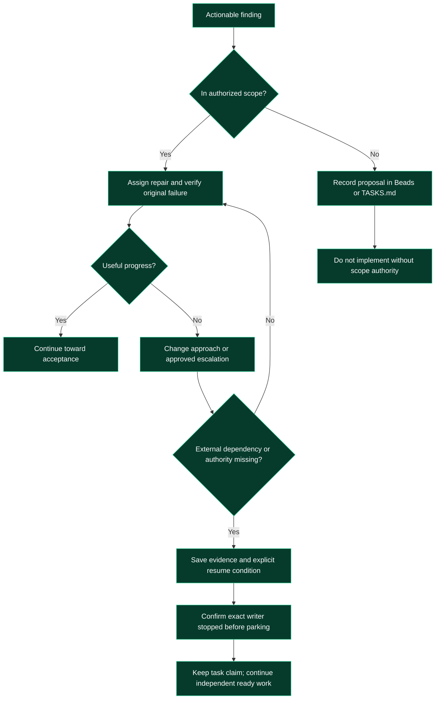

# Agent-Team

Created by [thebpandey](https://github.com/thebpandey). An orchestrator-led development skill for Codex and Claude Code: small parallel assignments, independent review, automatic repair of ordinary findings, and verified integration.

> **Local implementation preview.** This checkout contains the approved workflow changes, but final native-host qualification and publication are pending. The published 6.5.0 release does not contain all the behavior described below. Do not treat fixture tests as native Codex/Claude certification.

New here? Open the [standalone dark-green, collapsible HTML guide](Getting_Started_with_Agent-Team.html) in your browser, or read the [short Markdown guide](GETTING_STARTED.md). Both start with GitHub authentication and optional Project Kickoff.

## The workflow at a glance


```mermaid
flowchart LR
  A["Optional Project Kickoff<br/>Approve the project plan"] --> C["Agent-Team setup<br/>Reuse plan and selected tracker"]
  B["Existing plan or standalone task<br/>No Kickoff required"] --> C
  C --> D["Prepare capabilities<br/>Reload and verify discovery"]
  D --> E["Show roles and settings<br/>Quality-first defaults"]
  E --> F["Orchestrator admits ready work"]
  F --> G["Developers in isolated worktrees"]
  G --> H["Independent review and tests"]
  H -->|Required repairs| G
  H -->|Accepted| I["Serial integration and verification"]
  I --> J["Record evidence and update status"]
  J -->|Continuous and eligible work| F
  J --> K["Clean eligible worktrees"]
  J --> L["Release only with authority and passed gates"]
  classDef green fill:#063b2c,stroke:#34d399,color:#ffffff;
  classDef bright fill:#0b573a,stroke:#a3ff64,color:#ffffff;
  class A,B,C,D,E,G,H,K,L green;
  class F,I,J bright;
```

One selected Beads tracker **or** one local `TASKS.md` owns task state. A dashboard, checkpoint, setup receipt, or plugin never becomes a competing tracker. If the selected Beads backend is unavailable, Agent-Team diagnoses it; it does not quietly start a Markdown replacement.

Ordinary lint, test, and review findings trigger bounded in-scope repair without waiting for “please continue.” A real external blocker can be parked safely while independent work continues. New authority, credentials, a changed product decision, an explicit pause, or a required user preview approval still needs the user.

## 1. Prepare access and prerequisites

Paste this into your chosen host; it is an **agent prompt**, not a shell command:

```text
Prepare this environment for Agent-Team from https://github.com/thebpandey/agent-team.
Check this host and account access, Git, GitHub CLI (gh), Node.js 24 and npm.
Show the official source and intended installation scope before installing missing prerequisites.
Preserve existing accounts and configuration.

Check gh auth status and repository access. Guide me through browser/device login and any organization SSO approval. Never ask for a token, password or secret in chat.
```

Host login and GitHub login are separate. Install [Git](https://git-scm.com/downloads), [GitHub CLI](https://cli.github.com/) and [Node.js 24](https://nodejs.org/) if missing. The agent can prepare supported tools within the authorized scope; you complete browser sign-in, model/account access, administrator approval and native trust steps. [GitHub's authentication guide](https://cli.github.com/manual/gh_auth_login) explains browser/device login.

The source repositories are publicly visible, but visibility is **not** a license grant. Agent-Team and Project Kickoff retain their own proprietary terms. Keep licensed skill packages out of application commits.

## 2. Optional: plan with Project Kickoff first

[Project Kickoff](https://github.com/thebpandey/project-kickoff), also by thebpandey, defines a new project, audits an existing one, or replans a major revision. It produces approved planning records and an Agent-Team handoff; it does not implement the product or automatically launch Agent-Team.

```text
Install the complete Project Kickoff package from https://github.com/thebpandey/project-kickoff at tag v0.3.0 under its applicable license.
Use this confirmed project's .agents/skills/project-kickoff for Codex or .claude/skills/project-kickoff for Claude Code.
Preserve customizations, references, assets, scripts and metadata.
Exclude the licensed package from application commits using the project's local Git exclude.
Do not change global settings or enable optional hooks. Verify discovery and explain any reload step.
```

Then invoke `$project-kickoff start <idea>` in Codex or `/project-kickoff start <idea>` in Claude Code. Answer and approve the planning stages. For existing work, use `audit <path>`, `audit-only <path>`, or `resume <path>`.

Kickoff's own dependency installation and optional hooks have separate approval steps; its optional hook runtime requires Python 3.9+ on supported Linux/macOS/WSL systems. Python is not needed merely to read the skill.

Already have an approved plan or a clearly defined task? Skip Kickoff. Agent-Team works independently and preserves the existing branch, tracker and authority boundaries.

## 3. Install Agent-Team, then reload

```text
Install the complete Agent-Team package from https://github.com/thebpandey/agent-team using the managed installer and my authorized access.
Inspect the exact source revision, license and existing installation first.
Select only my actual host: codex or claude-code. Use user scope unless I explicitly select project scope.
Preserve customized and unowned packages, hooks, role definitions and unrelated settings.
Verify the installed package, report the installation receipt, and tell me which reload, trust and discovery checks remain.
```

One complete universal package serves both hosts. Installing both is an explicit choice, never an inferred default.

| Installation scope | Codex skill | Claude Code skill |
| --- | --- | --- |
| User: available across projects | `~/.agents/skills/agent-team` | `~/.claude/skills/agent-team` |
| Project: only the selected repository | `.agents/skills/agent-team` | `.claude/skills/agent-team` |

Project hooks use `.codex/hooks.json` or `.claude/settings.local.json`; user hooks use `~/.codex/hooks.json` or `~/.claude/settings.json`. Managed Claude roles use the matching `.claude/agents` scope. Installation receipts support ownership-aware updates and rollback; customized resources are retained and reported.

Restart/reload Codex or Claude Code after installation. Open native `/hooks` where supported and inspect the intended registrations. Approve “Trust all” only after reviewing every affected entry. Asking the agent to trust hooks does not bypass native consent or organization policy.

Confirm discovery with `$agent-team help` or `/agent-team help`. Installation, registration, adapter support, native support, trust and observed event execution are separate facts. Unknown stays unknown. See the [lifecycle hook guide](references/hooks.md).

### Agent-run installer reference

From an inspected complete source checkout, the agent can run:

```bash
node hooks/agent-team-cli.mjs install --host codex --scope user
node hooks/agent-team-cli.mjs install --host claude-code --scope project --project /absolute/project/root
node hooks/agent-team-cli.mjs health --project /absolute/project/root
```

Choose the intended command; do not run both unless both installations were requested. `--host both` is supported for an explicit two-host installation. Never omit the host/scope to guess the destination.

## 4. Run setup once

Use `$agent-team setup` or `/agent-team setup`. Setup adopts the approved Kickoff handoff, an existing plan, or a standalone task; checks actual readiness; and shows a grouped summary with targeted fixes.

| Order | What must be ready | Who handles it |
| --- | --- | --- |
| 1 | Host/account, Git, gh, Node.js 24/npm, project access | Agent prepares supported tools; user completes authentication/admin steps. |
| 2 | Agent-Team package, selected host registration, reload/trust | Managed installer plus native user controls. |
| 3 | uv/managed Python and Serena's selected language-server prerequisites | Automatic preparation in supported scope; actual semantic lookup required. |
| 4 | Microsoft Playwright CLI, browser binaries and required OS libraries | Automatic preparation; OS libraries may need administrator action. |
| 5 | Default-selected tools and skill profiles | Compatible copies reused, sources pinned, functional checks recorded. |
| 6 | Beads and its actual backend, when selected | Capability-specific verification; no unconditional external Dolt-server requirement. |
| 7 | Optional components | Only after selection. |

Mandatory capabilities and selected defaults are prepared automatically on first setup, without a separate approval question for every already-selected component. This does not grant administrator privileges, accept external terms, overwrite custom settings, or fabricate native discovery.

A file existing on disk is not proof that a tool works or that a fresh worker can access it. Setup reports **installed → detected → functional → available to worker** separately. Ordinary failures are diagnosed and repaired; an unavailable required gate remains pending.

### Prepared tools and official repositories

| Component | Default | Why it is included |
| --- | --- | --- |
| [Serena](https://github.com/oraios/serena) | Mandatory | Semantic code navigation with isolated project/worktree context. |
| [Microsoft Playwright CLI](https://github.com/microsoft/playwright-cli) | Mandatory, including backend projects | Default browser automation for real interaction and visual verification. Host-required browser controls take precedence. |
| [ast-grep CLI](https://github.com/ast-grep/ast-grep) | Prepared | Structural code search alongside Serena; scoped rewrites still require tests. |
| [LeanCTX](https://github.com/yvgude/lean-ctx) | Prepared, narrowed | Compact output with exact-source recovery; no broad permission, proxy or second-memory/controller setup. |
| [Superpowers](https://github.com/obra/superpowers) | Selected procedures | Relevant TDD, debugging and verification inside Agent-Team's existing workflow. |
| [Ponytail](https://github.com/DietrichGebert/ponytail) | Local skills | Simple, readable implementation and focused overengineering review; no MCP or blanket hooks. |
| [Impeccable](https://github.com/pbakaus/impeccable) | Skill and detector | UI guidance and batched checks; detector success does not replace browser review. |
| [React Best Practices](https://github.com/vercel-labs/agent-skills/tree/main/skills/react-best-practices) | Individual skill | Relevant React/Next rules only; no entire Vercel plugin bundle. |
| [Beads](https://github.com/gastownhall/beads) | When selected | Canonical tasks, owners, dependencies and evidence. Main `bd` implementation; no `beads_rust`. |
| [Context7](https://github.com/upstash/context7) | Optional | Version-specific library documentation. Helpful for unfamiliar APIs; adds an external docs service. |
| [beads_viewer](https://github.com/Dicklesworthstone/beads_viewer) | Optional | Additional dependency-graph data for the local dashboard; separate upstream terms apply. |

Preparation is not context loading. Each fresh worker reads the complete applicable skill instructions and only the required references for its assignment. It does not inherit proof of reading from the parent or load every installed plugin. Relevant source and test output remain available uncompressed.

See [dependency profiles](references/dependencies.md), [setup](references/setup.md), and [LeanCTX boundaries](references/lean-ctx.md). No RTK, agent-browser, Backlog.md, GSD, Ralph, Caveman runtime stack, or beads_rust is added.

## 5. See and change role settings

Ask `agent-team settings` for the overview, or “change the reviewer model” for a focused edit. Friendly model labels and compatible effort choices are shown in native controls where available, otherwise as numbered options. You do not need to memorize IDs.

| Name | Role | Responsibility |
| --- | --- | --- |
| Morpheus | Project/team orchestrator | Scope, assignments, shared records, integration and release gates. |
| Neo | Complex developer | Difficult or tightly connected engineering work. |
| Trinity | Standard developer | Feature and UI implementation. |
| Tank | Routine developer | Bounded changes and defined checks. |
| Agent Smith | Independent reviewer | Requirements and code quality in one focused review loop. |
| The Oracle | Visual reviewer | Real interaction, accessibility and responsive visual review. |

The overview shows each role's saved/effective model, effort, source, availability and whether the host actually enforces it. Quality-first is the default. An unavailable choice is reported, not silently downgraded. Codex and Claude Code preferences are stored separately; switching hosts does not erase either profile. A skill cannot change its parent process's model or grant model access.

| Setting | Built-in default | Effect |
| --- | --- | --- |
| Parallel teams | 1 | Requested active capacity, limited by real host slots and reserved review capacity. |
| Continuous | Off | Admit more authorized eligible work as verified integration or safe parking frees capacity. |
| Auto-deploy | Off | Submit verified batches to an already authorized target; never grants new authority. |
| Deployment batch | Effective team limit | Number of completed top-level delivery tasks per batch; an explicit size overrides it. |
| Model/effort | Quality-first profile | Per-host routes and approved fallback/escalation choices. |
| Usage budget | No hard limit | Soft limits guide efficiency; an explicit hard limit requests a safe checkpoint, not waived tests. |

Back/Cancel leaves settings unchanged. The full wizard is opt-in. Saved changes affect future dispatches; active run choices are not silently rewritten. See [settings](references/settings.md).

## 6. Start development and let the orchestrator continue

These are skill requests, **not terminal subcommands**:

| Codex example | Meaning |
| --- | --- |
| `$agent-team start` | Use saved run defaults and existing ready work. |
| `$agent-team start 2 continuous` | Keep up to two safe development teams working through the authorized scope. |
| `$agent-team start feature-name` | Work only on that existing named task. |
| `$agent-team Implement <clear feature request>` | Define the requested canonical task, then implement and verify it. |
| `$agent-team start with-preview` | Require your approval of the submitted preview before integration. |
| `$agent-team status all` | Read all project teams/tasks without interrupting work or running tests. |
| `$agent-team pause all` | Checkpoint and safely stop the project's affected activity. |
| `$agent-team resume all` | Reconcile evidence and surviving writers before resuming unfinished work. |

Replace `$agent-team` with `/agent-team` in Claude Code. Natural language also works. See [full command help](references/help.md), [runs](references/runs.md) and [release rules](references/release.md).

The orchestrator gives each developer a bounded task packet, acceptance criteria, owned paths, exact references and a return contract. Independent work uses isolated worktrees. Small work can remain with the orchestrator when dispatch would cost more than it saves. Reviews cover requirements and code quality; ordinary findings feed the same automatic repair loop.


```mermaid
flowchart TD
  A["Actionable finding"] --> B{"In authorized scope?"}
  B -->|Yes| C["Assign repair and verify original failure"]
  C --> D{"Useful progress?"}
  D -->|Yes| E["Continue toward acceptance"]
  D -->|No| F["Change approach or approved escalation"]
  F --> G{"External dependency or authority missing?"}
  G -->|No| C
  G -->|Yes| H["Save evidence and explicit resume condition"]
  H --> I["Confirm exact writer stopped before parking"]
  I --> J["Keep task claim; continue independent ready work"]
  B -->|No| K["Record proposal in Beads or TASKS.md"]
  K --> L["Do not implement without scope authority"]
  classDef green fill:#063b2c,stroke:#34d399,color:#ffffff;
  class A,B,C,D,E,F,G,H,I,J,K,L green;
```

A retry cap is a signal to change strategy, not permission to declare incomplete work successful. Explicit pauses and required preview approvals are never automatically overridden.

## 7. Inspect the optional local dashboard

Ask: “Show Agent-Team status as a local webpage, including overall progress, teams and every task.”

The default dashboard is a standalone local HTML snapshot. No React, Vite, database, mandatory server or external upload is required. It shows task progress, all task statuses, teams, active/parked/paused work, freshness and available evidence. A zero-task project shows N/A; unavailable data is not presented as zero.

- **Snapshot:** open the generated file in a browser. After the agent regenerates it, reload the file. Browser reload alone cannot execute Beads or refresh the source.
- **Opt-in live mode:** a small local Node process binds only to loopback. Opening the page or pressing Refresh reads current state through the same status model. Stop it when finished. It is not a remote service or a task controller.
- **Failure:** retain the last good snapshot with an explicit stale/unavailable indication. Do not replace it with an empty “100% complete” report.

When automatic snapshots are explicitly enabled, meaningful recorded transitions refresh the snapshot; read-only CLI status does not enable the feature or mutate tasks. Progress counts unique actionable tasks, excluding summary groups, cancellations and approved deferrals. It measures tasks, not time or effort.

### Optional beads_viewer attribution and boundaries

[beads_viewer](https://github.com/Dicklesworthstone/beads_viewer) (`bv`) is created by **Jeffrey Emanuel**. Agent-Team's adapter references it as a separate third-party component. It does not bundle or relicense the TUI engine, binaries or web assets.

The adapter uses a fresh export from the selected canonical `bd` backend in isolated staging and requests bv's JSON graph output with hooks disabled. Exported JSONL is a rendering input, not task authority. Graph selection filters the task list; the complete task list remains useful when graph generation is unavailable.

Read the [complete upstream LICENSE](https://github.com/Dicklesworthstone/beads_viewer/blob/main/LICENSE), including its OpenAI/Anthropic rider and disclaimers, before enabling or distributing bv. Do not describe it as unrestricted MIT. Attribution and repository links do not establish eligibility for every user or use case. Agent-Team's built-in dashboard works without bv.

## Continuity, efficiency and cleanup

Keep the orchestrator's context small: reuse verified facts, send compact task-specific packets, avoid repeated discovery and save authored decisions **before** the context fills. Recovery records preserve original source fingerprints, task attribution, evidence revision, pending operations and the next action.

Native auto-compaction stays enabled as a fallback. Agent-Team cannot promise zero compaction, recover unwritten decisions after a crash, or automatically replace its parent conversation on every host. Recovery rechecks stale source and writer evidence; it does not blindly trust the newest summary file.

Usage reports distinguish observed per-agent receipts from estimates and missing data. Cached input is a subset of input, not an extra charge. Missing worker records, repair overhead or prices remain unknown; no unmeasured token-saving percentage is claimed. Required tests and independent review remain mandatory under any efficiency profile.

After verified integration, eligible development worktrees can be cleaned even with auto-deploy off. Cleanup requires a stopped identified writer, clean/integrated work, retained evidence and no required preview. Preserve unfinished/user/shared files and uncertain resources. Deployment is a separate gate.

See [recovery](references/recovery.md), [canonical state](references/state.md), [status](references/status.md) and [team coordination](references/team.md).

## Source, versions and updates

The official source is [thebpandey/agent-team](https://github.com/thebpandey/agent-team). The current skill version is **6.5.0**; `metadata.version` in `SKILL.md` is authoritative. [Published v6.5.0](https://github.com/thebpandey/agent-team/releases/tag/v6.5.0) is the baseline, not certification of this unreleased preview. See the [latest official release](https://github.com/thebpandey/agent-team/releases/latest) and [changelog](CHANGELOG.md).

Use an identified authorized revision and the complete package. Universal archives have an `agent-team/` prefix and include `SKILL.md`, `README.md`, `LICENSE`, `CHANGELOG.md`, `agents/`, `references/`, `assets/` and `hooks/`. External dependencies and model access are not bundled. Inactive `legacy/` and maintenance tests are excluded. Provenance lives in `.agent-team-source.json`; verify the exact revision and checksum.

Maintainer reference, from a qualified committed source revision:

```bash
node hooks/agent-team-cli.mjs check-package
node hooks/agent-team-cli.mjs build-artifacts --revision <full-commit-id> --output ../agent-team-artifacts
node hooks/agent-team-cli.mjs check-artifacts --revision <full-commit-id> --archive ../agent-team-artifacts/agent-team-6.5.0.zip
sha256sum ../agent-team-artifacts/agent-team-6.5.0.zip
```

On macOS, use `shasum -a 256` on the same exact archive. These are local build instructions, not a claim that a universal preview release asset is already published. Change the version consistently before releasing altered contents; never replace an existing released version with different files.

For updates, inspect whether the installed copy is a Git clone, symlink or extracted package. Preserve local customizations and use the matching managed scope/host. Updating a source checkout does not update installed copies automatically. Reload the host and verify discovery afterward. Rollback/uninstall removes only matched owned resources and reports retained conflicts; it does not delete unrelated plugins.

## Verification and license

Portable tests cover contracts and actual shipped Node consumers; native host registration/discovery, mandatory dependency functionality and real browser behavior are separate qualification gates. Exact archive tests cover Codex, Claude Code and explicit both-host selection across user/project scope. No universal cross-platform guarantee or synthetic-to-native equivalence is claimed.

This release is governed by the [LearnStack OS Proprietary Skill License](LICENSE), including its entitlement and distribution restrictions. Public source access is not unrestricted permission to modify, redistribute or resell. Third-party components retain their own licenses.

Repository guide: `SKILL.md` is the selective entrypoint; `references/` holds conditional instructions; `hooks/` contains Node standard-library helpers; `assets/claude-agents/` contains native role definitions; `assets/dashboard/` contains the original local dashboard; `tests/` contains maintainer verification.
