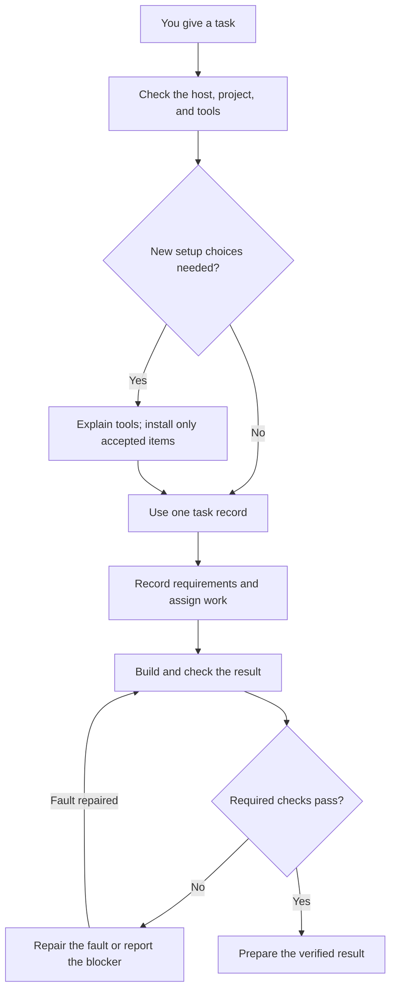
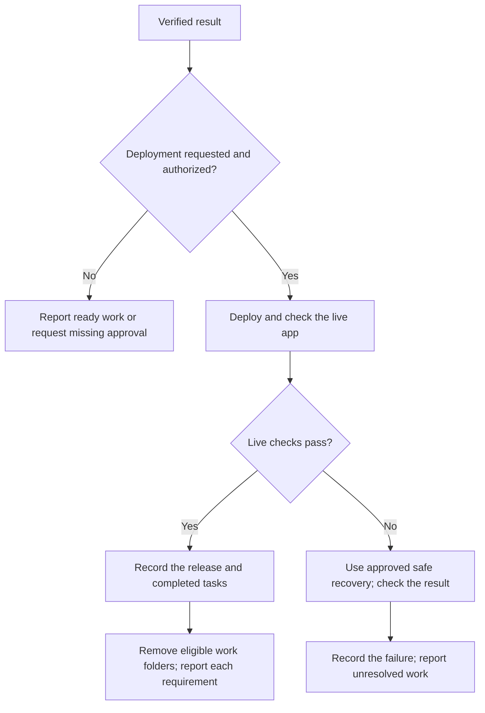

# Agent-Team

Agent-Team is a development skill for **Codex and Claude Code**. A skill is a set of instructions for an AI agent. The host is the app that runs the agent.

Give Agent-Team a task. It selects a suitable team, records progress, checks the result, and reports which requirements it met. The lead agent is called the **orchestrator**. It assigns work and controls the final checks.

Tool descriptions use short sentences and consistent terms based on [ASD-STE100 principles](https://www.asd-ste100.org/STE_faq.html). Official tool names and commands keep their original form.

## Install

Install this repository as the `agent-team` skill using your host's supported skill installer. The repository root contains `SKILL.md` and its supporting references.

For Codex CLI on macOS/Linux, a manual user-wide installation is:

```bash
mkdir -p ~/.agents/skills
git clone https://github.com/thebpandey/agent-team.git ~/.agents/skills/agent-team
```

If that destination already exists, inspect and update your existing installation instead of cloning over it. Use the current host documentation for other installation locations or operating systems. ChatGPT-managed skill installation is separate from installing into your own laptop/server.

Select GPT-6 Astra with high reasoning in Codex, then invoke:

```text
$agent-team setup
$agent-team Add the requested feature, verify it, and reconcile every requirement.
```

For **Claude Code** on macOS/Linux, install the same repository in Claude's user skill directory:

```bash
mkdir -p ~/.claude/skills
git clone https://github.com/thebpandey/agent-team.git ~/.claude/skills/agent-team
claude --model claude-fable-5-1 --effort high
```

Then invoke:

```text
/agent-team setup
/agent-team Add the requested feature, verify it, and reconcile every requirement.
```

For project scope, use `.claude/skills/agent-team` instead. Setup also provisions the bundled native agent definitions in `.claude/agents/`, or the selected user scope, without overwriting existing definitions. Verify that Claude discovers them; a refresh or new session may be needed. Installation paths and invocation follow [Claude's skill documentation](https://code.claude.com/docs/en/skills).

Fable 5.1 requires Claude Code v2.1.255+ and account/provider access. Opus 5 with high effort is the disclosed orchestration fallback if Fable is unavailable or its usage-credit choice is declined. A skill cannot switch its parent model, grant model access, or accept purchases. See [Claude model configuration](https://code.claude.com/docs/en/model-config).

In ChatGPT, select Agent-Team from available skills or use its supported mention. ChatGPT installation does not install it on a laptop/server. Keep only one active installation per host/scope; inspect an existing destination before updating it.

Both platforms use the same main instructions and tool list. Agent-Team loads the instructions for the current host. Claude agent definitions are included. Codex uses its available agent controls.

## How Agent-Team works

The first diagram shows setup and development. Small tasks can stay with the lead agent. Larger tasks use developers and one focused review.


```mermaid
flowchart TD
    A["You give a task"] --> B["Check the host, project, and tools"]
    B --> C{"New setup choices needed?"}
    C -->|Yes| D["Explain tools; install only accepted items"]
    C -->|No| E["Use one task record"]
    D --> E
    E --> F["Record requirements and assign work"]
    F --> G["Build and check the result"]
    G --> H{"Required checks pass?"}
    H -->|No| I["Repair the fault or report the blocker"]
    I -->|Fault repaired| G
    H -->|Yes| J["Prepare the verified result"]
```

Agent-Team uses Beads or one local `TASKS.md` file. If any recommended tool is missing or declined, it uses the local file. Each agent saves short resume notes in its assigned `CONTEXT.md` file. The task record holds progress and failure history.

After two attempts without useful progress, the lead agent changes the approach or assigns a more capable developer. It does not repeat the same failed attempt. If the new approach also fails, it asks one focused question or reports the blocker.

The second diagram shows release and recovery. **Deployment** means publication of a checked app version to the intended destination. **Rollback** means restoration of an earlier working version.


```mermaid
flowchart TD
    A["Verified result"] --> B{"Deployment requested and authorized?"}
    B -->|No| C["Report ready work or request missing approval"]
    B -->|Yes| D["Deploy and check the live app"]
    D --> E{"Live checks pass?"}
    E -->|Yes| F["Record the release and completed tasks"]
    F --> G["Remove eligible work folders; report each requirement"]
    E -->|No| H["Use approved safe recovery; check the result"]
    H --> I["Record the failure; report unresolved work"]
```

Installation does not grant deployment permission. Agent-Team reuses an existing approval for the same target. It restores an earlier version only when the action is authorized and safe. It does not automatically reverse destructive data changes. If recovery fails, it stops further releases and reports the incident.

After every successful release or recovery, Agent-Team updates the active task record. A recovery does not mean that the requested feature is complete. Before work-folder removal, it preserves required evidence and checks that the work is deployed and verified. It keeps the main folder, unrelated work, and unfinished work.

## First-run setup

A dependency is a tool or skill that helps Agent-Team do a task. Agent-Team checks what is installed before it offers changes. It explains each tool in simple terms.

| Choice | What happens |
| --- | --- |
| Recommended tools for this project | Install the accepted recommended tools and useful optional tools. |
| All free tools that work here | Install accepted free skills and reference files. Add app packages only where needed. |
| Choose tools or skip installation | Install selected items, or continue without new tools. |

Before installation, you see the source, version, location, and proposed changes. Agent-Team remembers declined tools. It does not ask about them again unless you change the choice. It checks each selected installation before use.

A package is software that you can install. Some packages work only with specific app software. A collection can contain many separate components. Agent-Team adds only the needed parts. Paid features require existing access. Installation cannot bypass permissions or required approvals.

See the [setup procedure](references/setup.md) for exact installation rules.

## Recommended tools

These tools are recommended, not mandatory. You can decline any of them and continue with the local task file.

| Tool | What it does | When Agent-Team uses it |
| --- | --- | --- |
| [Ponytail](https://github.com/DietrichGebert/ponytail) | Helps the agents write simple code that meets the task requirements. | All agents use it when available and enabled. |
| [Using-Superpowers](https://github.com/obra/superpowers) | Gives the agents procedures to plan, build, find faults, and check their work. | All agents use the procedures that apply to their tasks. |
| [Beads](https://github.com/gastownhall/beads) | Stores tasks, task owners, progress, and records of failures. Shows which tasks must finish before other tasks can start. | Use it when Beads is selected and all four recommended tools are ready. Keep an existing local-file choice until changed. |
| [Impeccable](https://github.com/pbakaus/impeccable) | Helps the agents design and check clear, consistent app screens. | Use it for screen design, layout, and user controls. |


Every teammate uses the available skills selected for its task. Missing skills are not reported as used.

## Optional design tools

UI means the screens and controls that a person uses. UX means how easy the product is to understand and use. A component is a reusable screen part, such as a button.

React is software for building app screens.

Agent-Team offers all the options below during setup. It explains which ones fit the project.

| Tool | What it does | Use it when |
| --- | --- | --- |
| [UI UX Pro Max](https://github.com/nextlevelbuilder/ui-ux-pro-max-skill) | Gives the agents searchable examples of colors, fonts, and screen layouts. | A new design needs more reference examples. |
| [UI Skills](https://github.com/ibelick/ui-skills) | Provides a collection of separate design instructions. | One of those instructions helps with the current task. |
| [shadcn/ui](https://ui.shadcn.com/docs/installation) | Provides screen parts, such as buttons, forms, and menus. | The app needs reusable controls and supports this tool. |
| [Magic UI](https://github.com/magicuidesign/magicui) | Provides ready-made visual effects and screen parts with movement. | An effect helps explain or improve part of the page. |
| [Motion](https://motion.dev/docs) | Adds controlled movement to screen parts. | Simple built-in page styles cannot provide the required effect. |
| [React Bits](https://github.com/DavidHDev/react-bits) | Provides visual effects for text, backgrounds, and user controls in React apps. | The app needs a specific effect and meets the license conditions. |
| [Taste Skill](https://github.com/Leonxlnx/taste-skill) | Gives design instructions for a distinct visual style. | A landing page, portfolio, or major redesign needs more design direction. |
| [img2threejs](https://github.com/img2threejs/img2threejs) | Helps build a 3D scene from reference images. | Users need to view or interact with a 3D object. |
| [Awesome DESIGN.md](https://github.com/VoltAgent/awesome-design-md) | Provides written examples of colors, fonts, spacing, and layouts. | The agents need a useful design reference. This is a reference collection, not a program. |
| [Bklit UI](https://bklit.com/docs/skills) | Provides charts for app screens. | A dashboard needs to show measurements, totals, or changes over time. |


These tools are optional. Agent-Team does not install whole component collections or add unused packages. Motion+ features and Bklit Studio are separate products. React Bits has additional Commons Clause license conditions. Agent-Team does not automatically select the separate GPT-specific Taste variant.

See the [tool guide](references/dependencies.md) for tools needed by specific tasks, such as Git, Node.js, and Python. See the [UI procedure](references/ui.md) and [optional design guide](references/ui-optional.md) for selection rules.

## Team and workflow

| Role | Codex | Claude Code |
| --- | --- | --- |
| Orchestrator; trivial direct work | GPT-6 Astra, high | Fable 5.1, high |
| Standard developer | GPT-5.6 Terra, medium/high | Opus 5, high |
| Independent reviewer | GPT-5.6 Terra, medium/high | Opus 5, high |
| Complex developer | GPT-5.6 Sol, high; xhigh when warranted | Opus 5, xhigh |
| Routine developer and defined checks | GPT-5.6 Luna, low/medium | Sonnet 5, high |
| Optional simple text rewrite/paraphrase | Usually direct or Luna | Haiku 4.5, no effort override |

Claude routing uses **Opus xhigh for Sol-level work**, **Opus high for Terra-level development and review**, and **Sonnet high only for Luna-level work**. “Extra effort” means the native `xhigh` setting. If a required tier is unavailable, the harness reports it instead of silently downgrading. Haiku is limited to menial text transformations, never coding, investigation, testing, review, planning, or release decisions. Tiny rewrites may stay with the orchestrator to avoid dispatch overhead.

Claude selections were checked on 2026-09-04 against [Anthropic's model overview](https://platform.claude.com/docs/en/models/overview). This is a recommended role mapping, not a claim of benchmark equivalence. Exact IDs, supported effort, and availability handling are in the [Codex adapter](references/platform-codex.md) and [Claude adapter](references/platform-claude.md).

The lead agent handles small changes directly when a teammate would add unnecessary work. Larger changes normally use a developer and one independent reviewer. A worktree is a separate project folder managed by Git. Developers use separate worktrees for independent changes. Reviewers can reuse a stable folder. Agent-Team does not create judge panels.

Beads or the local `TASKS.md` file holds the task record. In local-file mode, only the lead agent writes task updates. Teammates send their results to the lead agent. Each `CONTEXT.md` file holds short resume notes, not a second task list. Checks cover changed behavior, common failures, and project requirements.

## Deployment and cleanup

The release diagram above shows the main decisions. Agent-Team checks the combined changes before release and checks the live app afterward. It records results before it removes completed work folders. It reports the result for every user requirement.

A skill does not run after its host stops. Use the deployment service's own health checks and recovery features when available.

## Repository layout

- `SKILL.md`: shared entrypoint; selects the adapter for the actual host.
- `agents/openai.yaml`: OpenAI display metadata; ignored by Claude.
- `assets/claude-agents/`: installable Opus developer/reviewer and complex developer, Sonnet routine developer, and restricted Haiku text assistant definitions.
- `references/`: platform adapters and conditional setup, dependency, team, state, UI, and release instructions.
- `legacy/claude-v3/`: preserved previous Claude workflow, inactive and not part of the current installation instructions.
- `CHANGELOG.md`: release history.

The former `astra-dev-harness` personal skill is renamed `agent-team`; avoid keeping two active copies. The public repository is the distribution source. Updates to an installed personal copy are explicit, not automatic two-way synchronization.

## Validation and license

This is an instruction-based skill. Structure, native agent frontmatter, internal links, and workflow consistency are checked; model routing, third-party installers, and production recovery still depend on the actual host/project and must be verified there. No universal cross-platform installation guarantee is made.

[MIT License](LICENSE). Third-party dependencies retain their own licenses.
