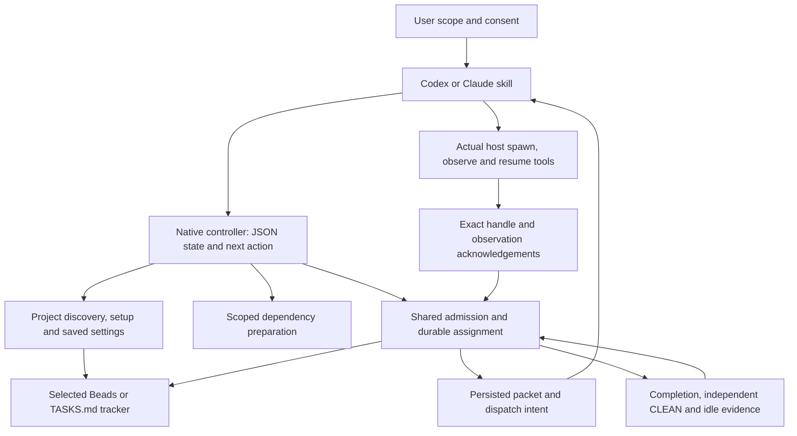

# Native architecture: 8.0.11

Version 8.0.11 was published on 2026-09-23. A subsequent actual managed
update failed at its installation journal size limit; see the
[8.0.12 repair](architecture-8.0.12.md). This architecture description does not
establish installed success or an observed host session.
The [first-use validation report](first-use-ux-validation.md) records its own
tested revision and distinguishes fixtures from real tool execution.

## Responsibilities and authority

The native host skills are thin conversation and tool adapters. They resolve the
installed executable through PATH or the install manifest, ask for missing
decisions, and follow the controller's `next_action`. Codex uses its actual
collaboration tools; Claude uses its actual Agent tool and supported resume
facility. Neither a successful command nor a reserved packet proves a worker
launched. Native setup and dispatch require no external hooks.

The Go controller owns project discovery, bounded admission, persisted intents,
settings, and evidence validation. One selected Beads or `TASKS.md` tracker owns
task state. Setup receipts, projections, prepared-tool receipts, and host
conversation history do not become alternative task stores. Saved role settings
cover both hosts and affect future dispatch; they do not switch the active parent
model or prove unsupported host controls work.

Missing worker/reviewer profiles receive current host defaults; explicit inherited
profiles remain inherited. Only the three documented legacy model IDs are normalized
on read and persisted by the next explicit settings save. Unknown custom IDs and
extension fields survive. See [settings](../references/SETTINGS.md) for the exact
mapping. Model availability remains separate from the saved preference.

The host skill collects numbered per-role model and effort choices from actual
host metadata, retaining each displayed index-to-ID mapping until the answer is
resolved. It saves accepted choices in one batch. Missing catalogs remain
unknown; cancellation leaves the draft unsaved. An alias-only Claude tool may
use an alias only when host metadata proves the same selected model.

## First use and preparation

`setup` inspects existing facts before asking for missing choices. Approved setup
creates missing governance/tracker artifacts and reuses existing task identities.
Project Kickoff 0.5.0 or 0.5.1 facts can arrive through the discovered nested handoff or an
explicit path. Approved late attachment is a separate digest-bound binding; it
preserves settings, the selected tracker, and active assignment packets. Refusal
stops the flow without automatically resuming setup.

Dependency preparation is separately consented and project scoped. A single
inventory covers selected Beads, Serena, Graphify, rg, ast-grep and LeanCTX plus
needed installer/Python prerequisites. Existing usable tools are reused. Managed
tools and preparation receipts live below `.agent-team/dependencies`; installation
does not edit global PATH, registry settings, or external hooks.

Tool availability and project readiness are separate states. `--prepare-only`
can install before planning. Analysis that requires source files or a Git commit
is deferred and retried after those inputs exist. Initialization validates actual
tool output and configuration before recording readiness. Unsupported existing
tools or invalid project output remain actionable failures; they are not success
receipts. Preparation uses its own bounded mutation guard so it can run under
setup's project guard without taking the same lock twice.

## Admission, dispatch and reuse

Both hosts use the same project discovery, tracker admission and worktree rules.
Normal work reserves a bounded assignment and persists its intent before host
dispatch. Repeating start reconciles that intent instead of generating another
worker. Acknowledgement binds the actual host identity to the run, team, task,
packet digest and candidate revision.

A packet replay reports its original `actual_host`. If a handle is foreign to the
foreground session, or launch intent exists without an acknowledged handle, the
host must observe/reconcile the original launch. Changing the foreground host
does not transfer ownership or authorize a duplicate. Observations stay unknown
when the host cannot establish liveness.

Retained reuse requires recorded completion, independent CLEAN review of the
exact revision, observed idle state, and the same host handle. Claude additionally
needs a supported host resume facility. Follow-up dispatch consumes eligible
queued work through the same admission boundary. A one-off task uses a bounded
standalone assignment; it does not silently create a second tracker.

Scoped pause, stop, cancel and resume persist admission controls. Their responses
separate requested intent from actual host observations. The skill acts on the
returned existing handles, then acknowledges exact observations. Clearing one
scope does not clear other holds or invent a worker state transition.

## Recovery and ownership

Project and preparation mutations use durable locks with owner/liveness checks.
Recovery requires evidence that the recorded owner is dead; unknown ownership
does not authorize takeover. Read-only status reports recorded state without
installing tools, repairing a tracker, or dispatching work.

The installer owns exact paths, sizes and digests in its manifest. Both hosts now
discover `skills/agent-team/SKILL.md` directly. Journaled update, rollback and
uninstall reconcile historical nested entrypoints, including an exact-byte manual
move to the root entrypoint. Unknown or modified files remain intact. Installer
recovery runs before checking conflicts that an interrupted transaction may have
created. Legacy Node hooks are retired only through their separately authorized
legacy migration contract.

## Release provenance

Packaging binds source revision, version authority, host skills, executable and
file checksums in the release manifest. Go module provenance is read from the
same executable bytes that are hashed, not inferred from the developer's module
cache or `go.mod`. The optional manifest module list preserves dependency-free
historical serialization.

Upgrade with the verified new distribution's controller against the existing
install manifest. Older controllers use a strict release decoder and cannot read
the new module field; the new controller still accepts historical manifests.

The native SBOM includes linked Go modules with their recorded versions, package
URLs and Go `h1` sums. A Go module sum is recorded as `go:module:sum`; it is not
misrepresented as the executable's SHA-256 or an inferred license. Artifact
build/verification cross-check embedded module metadata, and SBOM verification
checks the corresponding manifest. This covers the linked
`go.yaml.in/yaml/v3 v3.0.5` dependency introduced for YAML validation.

## Source map

| Boundary | Source |
| --- | --- |
| Host adapters | `vnext/codex/SKILL.md`, `vnext/claude/SKILL.md` |
| Public setup and readiness | `vnext/cmd/agent-teamctl/onboarding.go` |
| Project, settings and Kickoff binding | `vnext/internal/project/` |
| Dependency installation and initialization | `vnext/internal/preparation/` |
| Selected tracker implementations | `vnext/internal/tracker/` |
| Admission, intent, controls and dispatch | `vnext/internal/admission/`, `vnext/internal/start/`, `vnext/internal/dispatch/` |
| Mutation ownership and recovery | `vnext/internal/store/`, `vnext/internal/install/` |
| Native package, module provenance and SBOM | `vnext/internal/release/` |

Windows mutation recovery validates the recorded local PID and canonical process
creation FILETIME before probing liveness. With the fixed `OpenProcess` arguments,
`ERROR_INVALID_PARAMETER` identifies a process object that no longer exists;
access failures and errors from later identity queries remain unknown and block
recovery. Existing process objects still require creation-identity comparison and
the wait result. Recovery continues to remove only the exact recorded owner token.
